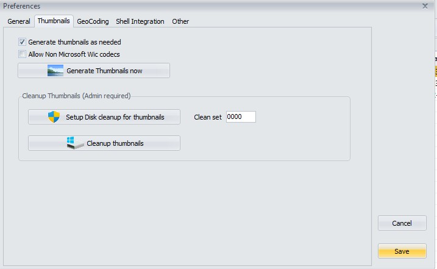
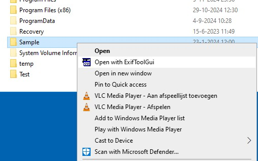
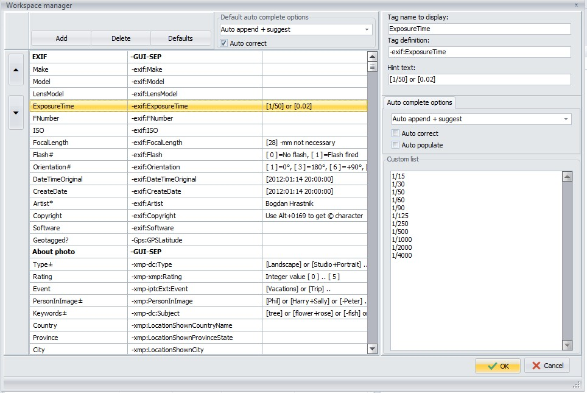
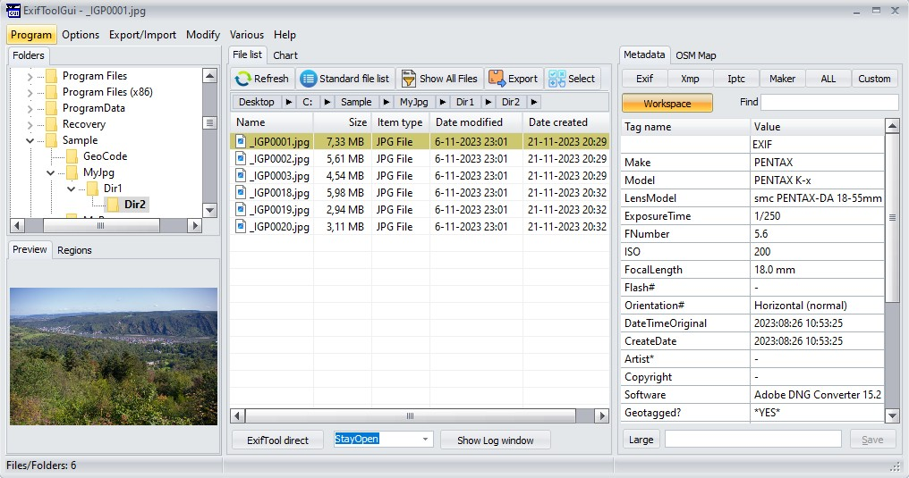
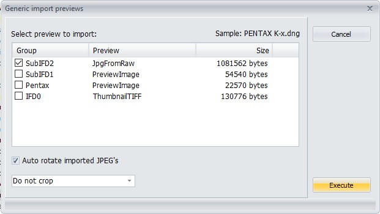

<html><head>
<meta http-equiv="Keywords" content="ExifTool,ExifToolGUI,exif,editor,viewer,reader">
<meta http-equiv="Description" content="ExifToolGUI">
<meta http-equiv="Content-Language" content="en-us">
<meta http-equiv="Content-Type" content="text/html; charset=utf-8">
<link rel="stylesheet" type="text/css" href="ExifToolGUI_V6_files/page.css">
</head>

<body>
<table class="A4">
<tbody><tr><td class="A4">
<h1>ExifToolGUI for Windows v6.xx</h1>

<h2>Introduction</h2>
In the summer of 2023 I decided to revive the ExifToolGui project initally created by <b>Bogdan Hrastnik</b>.
This revival resulted in <b>Version 6</b> 
Read his complete documentation <a href="https://htmlpreview.github.io/?https://github.com/FrankBijnen/ExifToolGui/blob/Development/Docs/Original%20notes/ExifToolGUI_V516.htm"><b>here</b></a>  
This was his intro, I will quote it now, because it still holds for me:  
<em>
There are many tools for viewing/editing metadata inside image files. In my opinion, <b>ExifTool</b> by <b>Phil Harvey</b>, is the best I've found so far. Here's why: 
<ul>
<li>-it shows more metadata tags than any other tool,</li>
<li>-it allows to edit almost any metadata tag,</li>
<li>-it is very secure to use, is regulary updated and has the best possible support.</li>
</ul>
 
The only downside for many potential users is the fact, that ExifTool is
 a "command-line" utility. That means, there's no Graphic User Interface
 (GUI), so all work must be done by typing commands inside "Command 
Prompt" window. Such approach gives ExifTool great flexibility, but is 
somehow difficult to use -especially for those, who don't use ExifTool 
regularly. 
 

So, I've decided to make some simple ExifTool GUI for my private use. 
There are already some GUI's that make use of ExifTool, but some of them
 are not flexible enough (for my needs) and/or have somehow limited use.
 When making ExifToolGUI, the main goal was: 
<ul>
<li>-view all metadata that ExifTool recognizes,</li>
<li>-ability to edit most frequently used metadata tags,</li>
<li>-batch capability (where appropriate), means: you can select multiple files and modify them at once.</li>
</ul>
 
Basic idea behind GUI is, to keep it <u>simple!</u> Thus, only those options are implemented, which I believe, are essential for majority of users. 
</em>
 
<b>Important changes in ExifToolGUI v6.xx</b> 
<ul>
<li>The source code now compiles with Delphi Community Edition. Version used, as of writing, Rad 11.3.</li>
<li class="tab">No (closed source) 3rd party libraries needed.</li>
<li class="tab">All source code provided on GitHub.</li>
<li>Added styles.</li>
<li>Image preview is handled by WIC (Windows Imaging Component).</li>
<li>Google Maps is replaced by Open Street Map.</li>
<li>64 Bits executable available.</li>
<li>Optionally copy the stack trace to the clipboard in case of an exception. Available in the released executables, If you compile from source code the Project-JEDI/JCL is required.</li>
<li>Better support for international characters. All internal code now uses Unicode (UTF16), to interface with Exiftool UTF8.</li>
<li>Enhanced Log Window. The last 10 commands are shown, with their respective output and error. Option to replay the command in PowerShell/Cmd prompt.</li>
<li>The external programs Jhead.exe and Jpegtran.exe are no longer needed. Rotation, and cropping, are handled in Delphi native code. With a modified library called NativeJpg by SimDesign B.V. (I tried contacting SimDesign to verify the Licence requirements, but was unable to.)</li>
<li>Exporting and Importing previews has been revised, and offer greater flexibility.</li>
<li>GeoCoding has been enhanced. You can now choose from 2 providers (https://overpass-api.de and https://geocode.maps.co) and lookup City, Province and Country from GPS coordinates AKA reverse GeoCoding.</li>
<li>Option added to show folders in the FileList panel.</li>
<li>Option added to show a Breadcrumb (Address bar) in the FileList panel.</li>
<li>Possibility to add Custom options to Exiftool.</li>
<li>Support for <a href="Readme%204K%20monitor.txt"><b>4K monitors.</b></a></li>
<li>Option added to show hidden files and folders. <b>Admins only</b></li>
<li>Enhanced integration. Add to Context menu in Windows explorer, Single instance App and minimize to Tray</b></li>
<li>Camera settings, Location info and About photo in Filelist detail supported for more File types</b></li>
</ul>
<a href="changelog.txt"><b>See changelog.txt for a complete list of issues.</b></a>

<a name="m_reqs_general">
<h2>Requirements and preparations</h2>
ExiftoolGUI should run on Windows 7, 8 32-64bit. However, it is highly recommended to use Windows 10 or 11 when you plan to use the OSM map, or GEOcoding. 
It will not run on Windows XP or earlier! 

<a name="m_reqs_exiftool">
<h3>1. ExifTool</h3>
You only need to download the "Windows Executable" zip file from <a href="https://exiftool.org/"><b>here</b></a>.
After unzipping, depending on your Windows Explorer settings, you will see:exiftool(-k) or exiftool(-k).exe
Rename it to either exiftool or exiftool.exe and put it in the same folder as ExifToolGui.  
<u>Notes:</u>
<ul>
<li>Bogdan Hrastnik recommended to copy exiftool into the Windows directory, but I strongly advise not to.
Microsoft makes it harder with every Windows version to modify System directories. 
If you want Windows to be able to always find ExifTool, then add the directory where it is saved in your PATH. 
</li>
<li>If you prefer an installer, I recommend the installer provided by <a href="https://oliverbetz.de/pages/Artikel/ExifTool-for-Windows"><b>Oliver Betz</b></a></li>
<li>You can overrule the location of exiftool in Preferences/other.</li>
<li>In case you've done something wrong in this regard, you'll see an error message when GUI starts.</li>
</ul>

<h3><a name="m_reqs_exiftoolgui">2. ExifToolGUI</h3>
You can download GUI from <a href="https://github.com/FrankBijnen/ExifToolGui/releases"><b>here</b></a>.
GUI doesn't need to be "installed". Just download the executable for your platform (ExifToolGui.exe or ExifToolGui_X64.exe) into any directory, create a Desktop shortcut and GUI is ready to use. 
 
<u>Notes:</u>
<ul>
<li>It is not recommended to put ExifToolGUI.exe into directories owned by operating system (Windows and Program files), unless you <u>know</u> what you're doing. </li>
<li>If a path is added at the commandline GUI will start in that path. (eg ExifToolGui &quot;c:\foto&quot;)</li>
<li>If a file is added at the commandline GUI will open that file and start in the path of the file. (eg ExifToolGui &quot;c:\foto\imgp001.jpg&quot;)</li>
<li>To open a file when GUI is already running, you can drag and drop a file from Windows Explorer.</li>
<li>Portable notes:
GUI doesn't write anything into the registry file. It does however create temporary files in the %TEMP% directory.  
It will save its settings in %APPDATA%\ExifToolGUI\ExifToolV6.ini, unless you use the commandline parameter <u>/DontSaveIni</u>.   
It was decided not to save the INI file in the same directory as the executable, because that location may not be writable. 
<a href="Readme Portable.txt"><b>See Readme Portable.txt for more info on portable use.</b></a> 
</li>
</ul>

<h3><a name="m_reqs_exiftoolgui"><a name="m_edge">3. Edge browser needed for OSM map<a></h3>
If you don't need the OSM map functionality, you can skip this step. 
The OSM map is hosted by an internal web browser based on Edge. There are 2 requirements. The <b>Edge Runtime</b> and the <b>WebView2Loader.dll</b>.

<h4><a name="m_edge_runtime">Edge Runtime<a></h4>
On modern Windows versions the runtime will be available standard. If it is missing on your system, or you want to install the latest version
<a href="https://www.microsoft.com/edge/download/insider?form=MA13FJ">use this link and install one of Edge Canary, Dev or Beta.</a> 

<h4><a name="m_edge_dll">WebView2Loader.dll</a></h4>
This dll is not standard available and can be downloaded from NuGet. I recommend to save it in the same directory as ExifToolGui.exe, but any directory that Windows searches will do.
If the dll can not be loaded you will get this dialog.  
   
<ul>
<li>
Download only the DLL from <a href="https://nuget.info/packages/Microsoft.Web.WebView2/"><b>Package explorer</b></a>. 
Navigate in the <b>Contents</b> pane to runtimes\<b>win-x86</b>\native or runtimes\<b>win-x64</b>\native, depending on your platform. 
Double-click on WebView2Loader.dll to start the download.  
  
</li>
<li>
Download the complete package from <a href="https://www.nuget.org/packages/Microsoft.Web.WebView2"><b>NuGet</b></a> manually. 
Select the version (Eg. 1.0.2194-prerelease) and click on <b>Download package</b>. (on the Right) 
This will get you a file named like 'microsoft.web.webview2.1.0.2194-prerelease.nupkg'. 
Rename the .nupkg file to .zip to open it in Windows Explorer, or open it with an archiver.  (Winrar https://www.win-rar.com/ and 7-Zip https://www.7-zip.org/ are known to work) 
Extract the file 'runtimes\win-x86\native\WebView2Loader.dll' or 'runtimes\win-x64\native\WebView2Loader.dll'.</li>
</ul>
<a href="https://docwiki.embarcadero.com/RADStudio/Sydney/en/Using_TEdgeBrowser_Component_and_Changes_to_the_TWebBrowser_Component">More info for developers from Embarcadero</a>
 

<h3>4. Wish to see thumbnails of raw image files?</h3>
Of course you do. What you need is a "raw codec", usually available for free from the camera manufacturer.
The best I've found so far is "FastPictureViewer codec" (from <a href="http://www.fastpictureviewer.com/codecs/">here</a>).
It is very fast, covers many raw formats and is free for personal use. 
<a href="Readme Using Codecs.txt"><b>Readme Using Codecs.txt</b></a>

<h3>5. jhead.exe &amp; jpegtran.exe</h3>
These files are no longer needed. 
 
 

That's all you need. And when a new ExifTool or GUI version is available, you only need to repeat process as described above. 
 

 
 
<h3>Content</h3>
<b>Menu:</b> 
<li><a href="#m_program">Program</a> menu</li>
<ul><li><a href="#m_workspace">Workspace manager</a> menu</li></ul>
<ul><li><a href="#m_style">Style</a> menu</li></ul>
<li><a href="#m_options">Options</a> menu</li>
<li><a href="#m_exp_imp">Export/Import</a> menu</li>
<li><a href="#m_modify">Modify</a> menu</li>
<li><a href="#m_various">Various</a> menu</li>
<li><u>Help/Online Documentation</u> menu</li>
 
<b>Panels:</b> 
<li><a href="#p_filelist">Filelist</a> panel</li>
<li><a href="#p_etdirect">ExifTool direct</a> panel</li>
<li><a href="#p_metadata">Metadata</a> panel</li>
<li><a href="#p_osmmap">OSM Map</a> panel</li>
 
<a href="#final">Final words</a>  

<h2><a name="m_program">Program menu</a></h2>
<h3>About</h3>
-Displays ExifTool and GUI versions and links. 
 
<h3>Preferences</h3>
 
  
<b><u>General</u></b> settings tab 
 
<b>Metadata language</b> 
Here you can choose the language for displaying metadata tag names and values in Metadata panel.
Selected language is also used when working in ExifTool direct mode (output to Log window),
or when exporting metadata to external TXT files. 
 
<b>Let GUI rotate JPG preview image</b> 
In most cases, you will need to check this option, because Windows 
doesn't automatically rotate JPG images according to Exif:Orientation 
tag value. Anyway, if this option is checked, then GUI won't 
change/rotate your JPG files physically: rotation (if needed) is applied
 in GUI's memory after the image has been loaded for displaying. If 
checked, GUI will only rotate image in Preview panel -thumbnails aren't rotated. 
 
<b>Enabling internet access</b> 
By default, this option is unchecked and if you are a bit paranoid, then
keep it that way. In that case however, you won't be able to use GUI's OSM Map
feature for geotagging your images manually. After changing this
option, you'll need to close and reopen GUI, to make this feature 
available. You have to enable this option also if you want to use GeoCoding. 
 
<b>Default Startup &amp; Export folder</b> 
I think, these two options don't need some special explanation. 
 
<b>Separator character</b> 
Some metadata tags (i.e. keywords, etc.) can hold multiple values and to
 be able to separate these values when showing, some "special" character
 is needed. Keep in mind, that this character isn't stored into 
metadata! -it is just used to separate values when displaying 
multi-value tags on <u>your</u> PC. 
 
<b>Save Filelist Details state on exit</b> 
If checked, then Details: button state and selected Filelist view (Standard filelist, Camera settings,..etc.) are saved when closing GUI. 
  

 
  
<b><u>Thumbnail</u></b> settings tab 
 
<b>Thumbnail size: 96, 128 or 160 pix</b>  
<b>Generate thumbnails as needed</b> 
Depending on the type of files, the codecs installed, and of course the system, generating thumbnails can be a time-consuming process.
You can disable automatic generating here.  
<b>Generate thumbnails now</b> 
if you dont have 'Generate thumbnails as needed' checked, this option allows you to manually generate them. You can also generate them manually from the context-menus on the folder and filelist.  
<b>Cleanup Thumbnails</b> 
The thumbnails that GUI generates are the same as Windows explorer uses. They share the same folder on your hard-drive.
Sometimes the cache gets corrupt, or you just want to cleanup. It can be done with the standard Windows program 'CleanMgr'.
For your convenience you can start that program here. 
<ul>
<li>First click on Setup Disk cleanup for thumbnails. If you dont know what 'Clean set' is used for, stay with the value '0000'.  
In the next dialog keep only 'Thumbnail' checked, and click on OK.</li>
<li>Cleanup thumbnails will start the actual cleaning.</li>
</ul>
  

 
  
<b><u>GeoCoding</u></b> settings tab 
 
Here you can setup the GeoCoding parameters. Typically you only have to check <b>Enable GeoCoding</b> 
For an in-depth explanation see <a href="Readme GeoCoding.txt"><b>Readme GeoCoding.txt</b></a>
  

 
  
<b><u>Shell Integration</u></b> settings tab 
 
<b>-application When minimized move to tray</b> 
Put an icon for GUI in the Windows System Tray, also known as the notification area, when GUI is minimized. 
You will likely have to make the icon visible in <b>Windows Taskbar Settings</b>. 
By clicking on the icon on the taskbar you can easily start GUI. A Right Click on the icon will show a menu with Version info, and the option to reset the window sizes. 
 
 
 
<b>-application Single instance</b> 
Allow only one running instance of GUI. If you try to start a second instance of GUI, it will try to make the running instance visible. 
Use this option when you have registered GUI in the Contextmenu, or you will get a new instance of GUI everytime you use the context menu. 
 
<b>Register ExifToolGui in Contextmenu (Requires elevation)</b> 
The buttons Add and Remove are only enable when you have started GUI as Admin. 
If you have added GUI to the contextmenu you can start it by Right clicking on a folder. 
 
  
<u>Notes:</u>
<ul>
<li>For Windows 11 you can find the context menu item under 'Show more options', or use SHIFT/Right click. If you search the net you can also find 'registry tweaks' that show the contextmenu directly. </li>
<li>When you decide to add GUI to the Contextmenu data is written to the registry. If you have concerns with that, because GUI is not <b>Portable</b>, dont use it.  </li>
</ul>
  

 
  
<b><u>Other</u></b> settings tab 
 
<b>Workspace: Move focus to next tag/line after value is entered</b> 
By default, when you hit Enter button to confirm changing tag value in
Workspace, focus of selected tag/line automatically moves to next
tag/line. If you prefer focus would remain on currently edited tag/line, then uncheck this option.
  
<b>Workspace: Double Click adds/removes tags</b> 
If you check this, double-clicking in the Workspace will remove a tag,
double-clicking on one of the tabs Exif, Xmp, Iptc, Maker, All will add that tag to the Workspace.
  
<b>Exiftool.exe location</b> 
If you need to override the location of exiftool.exe you can do that here.  
<b>Filelist: Show Folders in Filelist</b> 
The default setting is to only show files in the Filelist panel. If you enable this option, also folders (directories) will be shown, allowing easier navigation.  
<b>Filelist: Show Hidden Folders and Files in Filelist (Admin required)</b> 
Will also show hidden Folders and Files in the Folder Treeview and the Filelist panels. You need to be Admin to use this, and not everything you see may be readable/writeable.  
<b>Filelist: Show Breadcrumb (Address bar) in Filelist</b> 
Enable a BreadCrumb bar on top of the filelist. Allows for easier navigating.  
<b>Filelist: Show Hidden Folders and Files in Filelist (Admin required)</b> 
Will also show hidden Folders and Files in the Folder Treeview and the Filelist panels. You need to be Admin to use this, and not everything you see may be readable/writeable.  
<b>Filelist: Enable 'Camera Settings', 'Location info and 'About photo' for all file types. (Slower)</b> 
If you have set the <b>Details</b> of the filelist panel to any of the above options, GUI will show that info only for known filetypes. 
If a file is not supported, or it does not contain the data, GUI will show 'File type unsupported'. 
Generally speaking this works only for filetypes that have <b>IFD0, ExifIFD or XMP</b> groups.  
Examples that work: Tiff based raw (PEF, NEF, CRW, CR2, DNG), Jpeg, and recently I added FujiFilm (RAF) and CR3. 
Examples that do not work: PDF, MP4  
Enabling this option will result in calling Exiftool to get the data. While this works, it will slow-down getting the filedetails considerably. It is thus not enabled by default.  
<b>Hint pause timeout in Millisecs</b> 
Hovering over the metadata panel will display the complete metadata value as a hint. This was added because long values are often not completely visible. 
Setting this value to 0 (zero) will effectively disable the hints.
  

<h3><a name="m_workspace">Workspace manager</a></h3>
Here you define what will be shown in Metadata panel when Workspace is selected. Besides ExifTool direct option, this is the most powerfull GUI feature. 
 
 
 
 
<b>Tag name column</b> 
Here you define tag name you prefer to be displayed for particular 
metadata tag. These tag names don't have any influence on actual tag 
names and you can write anything here, i.e. instead of "ISO", you can 
have "Noise maker" here. 
Tag names written here, can have different "behaviour" in case special 
character is used for their ending. For now, GUI uses following ending 
characters: 
 

# -if tag name ends with this character (see 
Flash# and Orientation# above), then content of this tag will be 
displayed as usual. However, when modifying this tag, you need to enter 
numerical value.  
&ast; -if tag name ends with this character (see Artist* above), then that means,
that value defined in Hint text will be used as default value for this tag.
In this case, if you right-click on Metadata panel (when in Workspace view mode),
pop-up menu appears and there's option Fill in default values -you get the idea, I hope.  
? -if tag name ends with this character (see
Geotagged? above), then that means, that you're not interested on tag
value itself -what you wish to see is, if particular tag is defined or
not. <u>Note:</u> You won't be able to edit such tag in Workspace view.  
± -if tag name ends with this character (see
Type± in main screenshot above), then you'll be allowed to enter
multiple values for single tag at once (i.e. keywords and similar). Of
course, you can't use this feature for any tag, so read (Iptc &amp; Xmp)
metadata documentation to findout what tags support multi-values. Btw.
you can get ± character with Alt+0177 (typing 0177 on numerical
keyboard, while pressing Alt key). 
 
<u>Note:</u> I might use further special ending characters in future, so try to avoid their usage at the end (or start) of tag names. 
 

<b>Tag definition column</b> 
Here you define tags as recognized by ExifTool. And if needed, you can
also add # character at the end of tag name -this will force displaying
numerical tag value (try with -exif:Orientation# to see the difference).
Of course, only one single tag can be defined per line. 
To separate group of tags in Workspace view, special "fake" tag is used: -GUI-SEP
(see "About photo" on above screenshot). 
 

<b>Hint text column</b> 
Text entered here is your <u>short</u> "private" help, which will be displayed in GUI's status bar when you start modifying tag value: 
 
 
I hope you can recognize the power of Workspace manager:
 YOU define any metadata tag you wish to change regulary. Btw. you can 
move defined tags up/down by clicking &amp; moving tag name in first 
(Tag name) column. 
 
<h3>Workspace definition file: Load/Save</h3>
All tags defined for Workspace are automatically saved into <b>ExifToolGUIv6.ini</b> file.
So, when you start GUI, Workspace content is the same as it was when you used GUI the last time.
If for whatever reason, you might wish to save your <u>current</u> Workspace
content -to create a backup of your Workspace, so to speak. And when needed, you just load previously saved Workspace definition file again. 
 
When you choose Save, you'll be asked where to
save the file and you'll need to set the filename. By default, save
directory will allways be the directory where ExifToolGUI.exe is saved;
however, you can choose any other directory. 
When you choose Load, again, default starting
directory will be the one, where ExifToolGUI.exe is. And if you've
messed with your Workspace inbetween, you can choose to load Workspace
from ExifToolGUIV6.ini file -which simply reloads Workspace from last
GUI session. 
 
However, when saving, name of Workspace definition file can not be
ExifToolGUIv6.ini -you should use any names that reminds you on content,
 for example: MyWorkspace_XMP.ini. 
 

<h3><a name="m_style">Style</a></h3>
Shows a list of available style/skins. To change the appearance of GUI. 
 
The Styles Silver, Green and Blue try to mimic the colors available in V516
 

<h2><a name="m_options">Options menu</a></h2>

<h3>Don't make backup files</h3>
-if checked (default), then ExifTool won't make "filename.ext_original"
backup files. However, if you're not sure what you're doing, then you
better uncheck this option. 
 

<h3>Preserve Date modified of files</h3>
-no matter what I think about this, some prefer having this option checked. 
 

<h3>Ignore minor errors in metadata</h3>
-by default, this option is unchecked. This results, in case metadata is
 not "as it should be", ExifTool will output warnings/errors messages 
when trying to modify such metadata. That is, ExifTool will refuse to 
write into file in case metadata is not in "perfect" condition, or if 
there's a danger that you might lose some metadata by modifying it. 
If this option is checked and metadata only contain "minor" errors (or 
only "minor" damage can occur), then ExifTool will do his job anyway. 
 

<h3>Show Exif:GPS in decimal notation</h3>
-checked by default (because i.e. OSM Map uses this notation as well). 
 

<h3>Show sorted tags (not in Workspace)</h3>
-if this option is unchecked (default), then metadata tags are shown 
sorted as defined internally in metadata. Many times however, it's quite
 hard to find particular tag in listing, so I can imagine, that this 
option will be checked most of the time. 
Obviously, this setting has no influence on Workspace view output (see Workspace manager above). 
 

<h3>Show Composite tags in view ALL</h3>
Composite tags aren't "real" tags (their values are calculated from various existing tags), so they are shown optionally. 
 

<h3>Don't show duplicated tags</h3>
It can happen that the same tag is defined more than once inside image 
file and by default, GUI will show all of them. If you don't like this 
behaviour, then check this option, but warning: some other tags might also not be shown! -try with Exif GPS data, for example. 
 
All above options will be saved when exiting GUI and thus be applied in 
next GUI start. Remaining options settings however, are only temporary 
(as long GUI is running) and are not checked by default: 
 

<h3>Show tag values as numbers</h3> 

<h3>Prefix tag names with ID number</h3> 

<h3>Group tag names by instance (-g4)</h3> -This can help you to identify duplicated tags when viewing in Metadata panel. 

<h3>API WindowsWideFile (requires Exiftool v12.66)</h3> -Force the use of wide-character Windows I/O functions when the CharsetFileName option is used. 

<h3>Custom options</h3> -You can specify additonal options that exiftool should use. Expert option. Normally used with the Log Window. 
Possible use case is the option <b>-htmldump</b> and use the log window to catch the output. 
 
 
<h2><a name="m_exp_imp">Export/Import menu</a></h2>
<h3>Export metadata into : TXT, MIE, XMP, EXIF, HTML files</h3>
Every of these formats has different purpose: i.e. MIE is for making 
backup of complete metadata inside image file, HTML is meant for 
"studying" metadata structure, etc. So, try and see what suits your 
needs. 
 

<h3>Copy metadata from single file</h3>
This will copy metadata from single source file (can be MIE file too) 
into currently selected files. That is, all selected files will be 
populated with the same metadata. After you choose the source file, 
you'll have a chance to reduce the amount of metadata to be copied: 
 
 

<h3>Copy metadata into JPG or TIF files</h3>
If single (JPG or TIFF) file is selected (=destination), then metadata 
can be copied from any other file containing metadata (incl. MIE file). 
If multiple files are selected, then metatada will be imported only where source and target files have equal names. 
 
More details on how it works: 
As always in GUI, before you choose menu, you select one or multiple JPG
 (or TIFF) files -this are destination files. Now you select the menu 
and, no matter how many destination files you've selected previously, 
you'll be asked to choose only one source file (see 2nd scenario). Now, 
there can be two scenarios: 
<b>Scenario 1:</b> If you selected only <u>one JPG or TIF destination file</u>: 
All metadata from source file will be copied into destination file. And 
while destination file can only be JPG or TIF, source can be any kind of
 imagefile (raw, etc.). To put it simple: it's just copying all metadata
 from any kind of file into JPG (or TIF) file. 
<b>Scenario 2:</b> If you selected <u>multiple JPG or TIF destination files</u>: 
Now, you do remember by picking only one source file... in this case, 
you actualy didn't choose particular source file, but extension(!) of 
source files and folder where source files are. After executing, 
Exiftool only compares source/destination filenames -and where filenames
 match, metadata is copied. To put it simple: it's just copying all 
metadata between files which have equal filename (but can have different
 extension). 
Scenario 2 is very usefull in case you have converted many raw files to 
JPG/TIFF and you know, that your raw converter doesn't copy all metadata
 from raw into resulting JPG/TIF files. 
 
<u>Note:</u> Because it's assumed, that destination file has been 
modified inbetween (resized, etc.), not all metadata is desired to be 
copied. Because of this, you'll be asked, if you also wish to copy 
following tags: 
 
-in 99% cases, there will be no reason to check any of above option. 
 
<h3>Copy metadata into all JPG or TIF files</h3>
This option is very similar to above. The difference is: 
<li>No matter how many destination files you select (you must select at 
least one for menu to be enabled), metadata will always be copied into <b>all</b> JPG or TIF (but not both) files inside current folder. That is, this option behaves as if all JPG or TIF files are selected in <b>Scenario 2</b> above.</li>
<li>After you choose this menu option, you'll be first asked "should files in subfolders also be processed?". If we choose No, then again, this option behaves the same way as if all files are selected in <b>Scenario 2</b> above. However, if we coose Yes, then metadata will be copied into images in all subfolders as well (only where folder/file names are equal, of course).</li>
 
Let's see an example, where we wish to update jpg files with metadata from raw files: 
 
 
1. Select any destination file inside MyJpg\Dir1
 folder. If you select any JPG file, then only JPG files will be 
processed; if you select TIF instead, then only TIF files will be 
processed. 
2. Choose menu Copy metadata into all JPG or TIF files 
3. Click on Yes button when asked 
4. File browser will appear, where you select any (source) file inside MyRaw\Dir1 folder. <u>Note:</u> You only need to select one file (to specify file extension). 
5. A panel will appear, where you confirm/check which of "not desired" metadata you <u>wish</u> to be copied: 
 
<u>Note:</u> Even if none of above is checked, the rest of metadata in source files (Exif, Xmp, etc.) will be copied into destination files. 
 
That's it: after click on Execute, metadata will be copied into all files inside MyJpg\Dir1 folder (incl. Dir2 folder) from files inside MyRaw\Dir1 folder (incl. Dir2 folder). 
If we would choose No in step 3 above, then only files inside MyJpg\Dir1 would be processed. 
 

<h3>Import GPS data from: Log files</h3>
This option allows geotagging your files in batch by using log file of your GPS device (see here for <a href="https://exiftool.org/geotag.html">supported GPS files</a>).  
 
 
<u>Step 1:</u> <b>Select log file</b> of your GPS device. 
As usual in GUI, you first must select files you wish to geotag. In 
most cases, folder contents will contain series of "session" photos, so 
you will select all of them. 
 
<u>Step 2:</u> Check <b>use all log files in directory</b> if more than one log file for set of files exist. 
Let's say you've made three day trip to Venice. In such case all photos 
will reside in single folder, but three (or more) log files will exist 
for that set of photos. 
Note: In this case, it doesn't matter which (of multiple) log file you 
choose -important is, all log files must have the same extension. 
 
<u>Step 3:</u> Choose <b>Reference DateTime value</b>. 
Here you define which photo DateTime values to compare with those in log file. 
 
<u>Step 4:</u> Choose if <b>TimeZone offset</b> is needed to be taken into account. 
This is a funny one... The thing is, log files contain UTC time, while 
camera is usually set to local time (of where photo is taken). In most 
cases, we are dealing with two scenarios: 
<ul>
<li>Case A: Photos are taken in your local (time) area 
-in this case there's no need to use TimeZone offset option. Short 
explanation: if TimeZone offset option doesn't exist, ExifTool "assumes"
 that camera time and PC's system time have the same TimeZone offset and
 ExifTool will handle logged UTC time automatically.</li>
<li>Case B: Photos are taken somewhere outside your local TimeZone area 
-in this case you must use TimeZone offset option. Example: if you live 
in New York and photo was taken in Vienna, then you must set TimeZone 
offset to +01 (depending on winter/summer time?)</li>
</ul>
In both cases above it's assumed, that camera is set to local time of 
where photos are taken. It's also assumed, that when geotagging, your 
PC/laptop is set to your local (home) TimeZone. 
For further reading/questions see <a href="https://exiftool.org/forum/index.php/topic,3333.0.html">here</a>.  
<u>Step 5:</u> Check Update Geo Location, if you wish to update Country, Province and City. 
Click on <a href="#m_geotag_setup"><b>Setup Geo</b></a> to control how these fields are filled. 
Note: These fields are also shown in the filelist if it's set to 'Location info'. 
 

<h3>Import GPS data from: Xmp files</h3>
By using this menu, you can copy GPS data from xmp sidecar files into Exif GPS section of selected image files. 
<u>Note:</u> It is expected that image and sidecar files only differ in 
extension -name part however, must be equal. Example of valid 
image-sidecar file pair is: 
 
MyPhoto.jpg - MyPhoto.xmp 
&nbsp;&nbsp;or 
img_01.cr2 - img_01.xmp 
&nbsp;&nbsp;etc. 
 
Because image and sidecar files usually reside in the same folder (that 
is, they are mixed), it is a good idea to use file type filter (which is
 set to "Show ALL files" by default). That is, if you wish to write GPS 
data into JPG files, you should set filter to "JPG files only". However,
 this setting is not required!  
Workflow is as follows: 
<li>Sort files by file extension (so, for example, JPG and XMP files are
 grouped -not mixed) or use desired file type filter (i.e. "CR2 files 
only"). The only reason for doing this is: you can select (only) image 
files easier.</li>
<li>Select all image files you wish to modify.</li>
<li>After choosing menu <b>Import GPS data from xmp file(s)</b>, you'll 
be prompted to select folder containing (xmp) sidecar files -in most 
cases, that will be the same folder where image files reside.</li>
...and that's it. 
 

<h3>Generic extract previews</h3>
As you may know raw image files can also contain a JPG image, which serves for
previewing raw image file content. In most cases, this JPG image is "as
if photo would be taken in JPG mode" -while this is true for exposure 
and colors, resolution (pixel size) may differ (depends on camera). 
Because there are many flavours possible I created a generic function.
It shows, for the selected file, what previews are available, and their sizes. 
You can check which preview(s) to extract and optionally perform autorate, and or crop. 

  

<h3>Generic import preview</h3>
Use this option to update a preview. Before you choose this option select in the filelist which files to update. 
In this dialog select which preview to update. Optionally rotate and or crop. 
When you click on <b>Execute</b> browse to the folder containing the previews. The previews should have
the same base name as the raw files. Typically they are created by the previous option. 

 
 
See also the readme.<a href="Readme Lossless rotate_Import_Export previews.txt">Readme Lossless rotate_Import_Export previews.txt</a> 

<h2><a name="m_modify">Modify menu</a></h2>

<h3>Exif: DateTime shift</h3>
 
  

<h3>Exif: DateTime equalize</h3>
 
 

<h3>Exif: LensInfo from Makernotes</h3>
This will fill Exif:LensInfo of selected file(s) with relevant values from Makernotes data (where possible). 
 

<h3>Remove metadata</h3>
 
 
Note, that in some cases (depending on the image file format), it's not 
possible/safe to remove the metadata you've selected to remove. In such 
cases, ExifTool will simply refuse to remove such metadata (also see Ignore minor errors in metadata menu above). 
 

<h3>Update City, Province, Country from GPS coordinates</h3>
This option can update the location info (Country, Province and City) for the selected files. 
The selected files should already be geotagged, that is contain lat and lon values. 
For every selected file a lookup is done using the selected provider. To reduce the nbr of calls a cache is used. 
In the dialog you can customize how the fields are filled.  
  
Notes: 
- Due to the nature of this function, it uses an external webservice, there are some 'point of failures'. 
<ul>
<li>You need a reliable internet connection.</li>
<li>The external webservice could be (temporarily) out of service for various reasons.</li>
<li>The external webservice might change it's API.</li>
<li>etc...</li>
</ul>
- If you open the log window you can see the rest requests and their responses.  
<a href="Readme GeoCoding.txt">See also Readme GeoCoding.txt</a> 

<h2><a name="m_various">Various menu</a></h2>

<h3>File: Date modified as in Exif</h3>
-use it, if you feel the need. 
This is a remark originally made by Bogdan. I would like to add my comment why it's not a good idea. 
If you have a backup tool that relies on the Date Modified, it will not notice that a file is modified. Example: Robocopy 

 
<h3>File: Name=DateTime+Name</h3>
 
 

<h3>JPG: Lossless autorotate + crop</h3>
This will physically rotate selected JPG images according to Exif:Orientation value inside files. 
It uses a library NativeJpg by SimDesign B.V. to do the actual rotating. No external program is needed. 
In addition you have more control over how the function is performed.  
  
<a href="Readme Lossless rotate_Import_Export previews.txt">See also Readme Lossless rotate_Import_Export previews.txt</a>
 
 

<h2><a name="p_filelist">Filelist panel</a></h2>
 
 

<b>Refresh</b> button 
-will update folder (directory) content in filelist panel. This might be
 usefull in cases you're interested on file characteristics changes 
(size, etc.) after applied operations. 
 
<b>File filter</b> drop-down box 
-is set to Show ALL files by default on every 
GUI startup and this behaviour can't be changed. This drop-down box 
allready contain few predefined file filters and by clicking on Edit button, you can add additional filters which you need most often. 
 

<b>Details:</b> button 
-is "pressed" by default, which means, files are listed with detals 
about files. If this button is "de-pressed" then thumbnails are shown 
instead of file details. 
<u>Note:</u> Only thumbnails for "registered" image files will be shown 
as images. Meaning, for raw image files, you'll need to install 
appropriate raw "codec", to be able to see thumbnails and previews. 
 

<b>Details</b> drop-down box 
-is set to Standard filelist by default. This drop-down box also contain few predefined details views: 
Camera settings, Location info and About photo -where each of these views shows few metadata values inside files; i.e.:  
<u><b>Note:</b></u> The Folders and the Breadcrumb bar are shown only when enabled in Preferences/Other. 
 
 

No matter how disappointed you might be, you can't define/change tags 
shown in these predefined views. The main and only reason why's that is:
that's the only way I could get reasonable speed to show this data. 
 

But to give you at least something, the last entry in this drop-down box is User defined. If you select that, then Edit button on the right side becomes enabled, and by clicking on it, you'll get: 
 
-here you can define your own columns and metadata values to be shown. 
Note: Displaying User defined
 details view is noticeable slower than fixed predefined views. So, use 
this view on relative small amount of files in folder. In short: tryout. 
 

Developer note: Bogdan Hrastnik used JAM Shellbrowser for the filelist, and folderlist. I wanted to have sourcecode that did not rely on 3rd party libraries. The additional functionality needed for
ExifToolGui required extending the standard Embarcadero TShellTreeView and TShellListView. It proved to be more difficult than I anticipated. By now it works satisfactory. 
A few small modifications to the Embarcadero source are needed. You can find the ReadMe and source code in GitHub. 
<a href="..\Source\Vcl.ShellControls\ReadMe.txt">ReadMe ShellControls.txt</a>
 

<h2><a name="p_etdirect">ExifTool direct panel</a></h2>
By clicking on ExifTool direct button, you get an input field where ExifTool commands can be entered and executed: 
 
 
<b>StayOpen/Classic</b> Starting with version 6.2.0 you can choose how the commands are executed. 
<li>StayOpen. Send the commands to the ExifTool.exe program using stay open mode. This is the default, and doesn't start a new instance of ExifTool.exe.</li>
<li>Classic. Starts a new instance of ExifTool.exe, sends the commands, and waits for ExifTool.exe to complete. This was the default in previous versions. Retained for compatibility reasons.</li>
 
<u><b>Note:</b></u> Don't need to type "exiftool" here -GUI will take care of calling ExifTool for executing commands you have entered. 
<u><b>Note:</b></u> Even you're in "direct mode", Options menu settings for: 
<li>Don't backup files when modifying</li>
<li>Preserve Date modified of files</li>
<li>Ignore existing minor errors</li>
<li>Api WindowsWideFile</li>
are automatically applied by GUI -meaning: these settings are still valid. 
 

If you're a bit familiar with ExifTool usage, then here, you can execute commands not covered by GUI. Usage is very simple: 
<li>select one or more files</li>
<li>enter desired command and press Enter key</li>
Btw. you can close ExifTool direct mode by clicking on ExifTool direct button again, or Esc key while you're in edit line.
 
<h3>Some examples for exercise:</h3>
<code>-Exif:Copyright&lt;Exif:Artist</code> -copy value of Exif:Artist into Exif:Copyright 
<code>-Exif:DocumentName&lt;$filename</code> -save filename into Exif:DocumentName tag 
<code>-Xmp-aux:All=</code> -delete complete Xmp-aux section 
<code>-Exif:Artist="My Name"</code> -it's obvious, isn't it? 
etc... You can find more info <a href="https://exiftool.org/exiftool_pod.html">here</a>, on homepage of ExifTool. 
 

As mentioned, selected files are automatically added to the end of 
command, so you don't need to type them. However, there are cases, when 
you should <u>not</u> select source file, i.e.: 
<code>-tagsfromfile MyPhoto.jpg Result.xmp</code> 
-here, source file "MyPhoto.jpg" can't be placed at the end of command, 
so selecting it in filelist isn't what you want. If you select it 
anyway, then (in this case) xmp file will be created first (as 
expected), and after that, xmp file content will be added back to 
selected file -that's what you don't want. 
<b>Tip</b> Use the file filter to make sure no files are selected. 
 

If you wish to modify all files inside currently selected folder, <u>including files in subfolders</u>, then you should use -r option. Some examples: 
<code>-r -Xmp:all=</code> 
-deletes all Xmp metadata from all files inside currently selected folder and subfolders. 
<code>-r -Exif:Artist="My Name" -ext jpg</code> 
-set Exif:Artist tag value to My Name for all jpg files inside currently selected folder and subfolders. 
<code>-r -Xmp:City=Paris -ext jpg -ext tif</code> 
-set Xmp:City tag value to Paris for all jpg and tif files inside selected folder and subfolders. 
<u>Note:</u> If more than one extension is specified, then (processed) files counter only counts number of files defined by first file extension. Meaning: if more than one extension is specified, files counter might not reflect actual number of files. 
 

<u><b>Note:</b></u> You can't "redirect" output in ExifTool direct. If you need to do that (i.e. extract thumbnail image), then you should use ExifTool directly (that is, outside GUI). 
 

<h3>Using predefined ExifTool commands</h3>
There's one predefined ExifTool command in GUI, so you can see what's 
all about. To access it, you click on combo-box (blank on above image) 
and choose it: 
 
Once command is chosen, you can execute it by pressing Enter key (while 
you're in edit field). If needed, you can modify displayed command and 
execute it, without actually changing predefined command. 
 

<h3>Modifying predefined commands</h3>
By clicking on Edit predefined button, panel increases with additional options: 
 
 
^Delete -deletes currently selected predefined command permanently. 
^Replace -replaces currently selected predefined command (i.e. after changes have been made). 
^Add new -adds new command to the end of the list. 
^Default -makes currently selected predefined command selected by default each time GUI starts. 
Deselect -sets predefined commands combobox to "none selected" state. 
 
Note: Don't use = character in Command name field! -because in INI file, this character is used as separator between command name and actual command. 
 
<h3>Using args files</h3>
<b>args</b> file is a text file, usually containing several ExifTool 
commands, which are all executed by simple call of single args file. 
Here's a example of args file, containing two commands, written by 
Notepad:
<pre>-Exif:Artist="My Name"
-Exif:Copyright="C2012 by My Name"
</pre>
Let's save this text as "MyData.args". <u>Note:</u> File must be saved in the same folder where exiftool.exe is saved (or specify the full path to the args file). 
To execute above commands in GUI (after desired image files are selected), we need to write the following Command into ExifTool direct panel: 
<pre>-@ MyData.args
</pre>
-and press Enter key. 
 

ExifTool full source version (can be downloaded on top of ExifTool main 
page) contains several predefined args files, which are meant for 
transferring "similar" metadata between sections. One of them is (for 
example) "xmp2iptc.args" file, which copies all "compatible" metadata 
from Xmp to Iptc section. And as said, there are more of them. 
 
<h3>Show Log Window button</h3>
When using ExifTool direct mode, any results are written into the Log window when it is opened. 
If, for example, we select two files and execute following ExifTool direct command: 
<pre>-e -gps:all
</pre>
-we will get something like this: 
 
 
<u>Note:</u> In case of errors, the Log window with relevant messages automatically appears after ExifTool ends processing files. 
Starting with version 6.2.0 the Log window will show the last 10 commands. In the top panel you can select the command issued,  
on the left you will see what was sent to ExifTool, on the right you see the output it generated and in the bottom panel the errors, if applicable. 
To help identifying the commands an execnum is send to ExifTool, you can see this in the command window 'execute14 and -echo4 {ready14}',  
Exiftool will return this in the Output and Error.  
GUI uses execnums from 10-99, and when 100 is reached it is reset to 10. 
In the top you will see a checkbox 'Show all commands'. By default only the commands issued from Direct mode, or that return an error, are displayed.  
If you check this also the commands that GUI uses internally are displayed. 
With the buttons <b>Cmd prompt</b> and <b>PowerShell</b> you can generate a <b>.cmd</b> or <b>.ps1</b> script to replay the commmands. 
 
 

<h2><a name="p_metadata">Metadata panel</a></h2>
 
 
By clicking on any button on top row, relevant metadata will be shown -that is, top row is for displaying metadata only. 
 
In the second row, there's only one button: Workspace. This button is "pressed" by default on every GUI startup and this can't be changed by user. 
And where are the "good old" <b>[ ^ ]</b> edit buttons, known from previous GUI versions? They're gone.. they aren't needed anymore. 
As explained above (see Workspace manager menu), Workspace is fully customizable: user can define which tags he wishes to be listed here. 
And the value of any tag listed in Workspace can be edited at will.  

  
In the <b>Find</b> edit box you can enter a text, press Enter and the first line containing that text in 'Tag name' or 'Value' is highlighted. 
Pressing Enter again searches for the next occurence. 
 

<h3>Edit metadata in Workspace</h3>
  
Here's how to edit metadata in Workspace:
<li>Click on tag line you wish to modify</li>
<li>Press Enter key or click into Value edit field (which becomes yellow)</li>
<li>Write tag value and press Enter key when you're done (or press <b>Esc</b> key to cancel editing)</li>
<li>Tag name you've previously selected becomes yellow and contains the value you've just entered.</li>
<li>If needed, pick another tag and repeat the process.</li>
<u>Note:</u> Data isn't saved yet! 

 
If you've changed your mind and don't wish to change particular tag,
then select that tag, right-click (to show pop-up menu) and choose Undo selected editing -this is usefull in cases when many tags are allready edited and not saved. 
If you've changed your mind completely (don't wish to apply any changes), then just click on Workspace button and changes will dissapear. 
<u>Note:</u> Changes are lost in most cases when you click elsewhere outside Metadata view area. 
 
<li>When you're finished with editing metadata values, click on Save button.</li>
 
Some tag values may require a bit longer text to be entered (just <u>a bit</u> longer, please). To do that more comfortable, click on Large button and you'll get some more space: 
 
 

<b>Keyboard shortcuts</b> 
These keyboard shortcuts are recognized:
<li>Enter, Starts editing the field, confirms editing the value.</li>
<li>Esc, Abandons editing the value.</li>
<li>CTRL + C, Copies the value of the current row to the Clipboard.</li>
<li>CTRL + S, Saves the pending changes. (Same as clicking Save)</li>
<li>CTRL + Home, CTRL + End, Moves to first, last line of the metadata.</li>
<li>CTRL + Up, CTRL + Down, Loads the previous, next file. The changed data is not saved.</li>
 

<b>Editing tags which names ends with ± character</b> 
This sign means tag can have multiple values defined (where keywords are
 most known). Posibilities for entering values for such tags: 
bird -all existing keywords will be deleted and keyword "bird" will be saved. 
+flight -keyword "flight" will be added to existing list of keywords. 
-bird -keyword "bird" will be deleted from existing list of keywords (if it exist). 
 
You can also add multiple keywords at once, for example by entering: +nature+daylight+sky 
or you can delete multiple keywords at once, for example: -water-tree 
 
<u>Note:</u> As you know by now, you can't enter keywords which contain + or - sign (which is a bad keywording habbit anyway). 
<u>Advice:</u> Don't write stories into keywords -by it's definition, a keyword is meant to be a (single) word. 
 

<h3><a name="m_popup_meta">Pop-up menu in Metadata panel</a></h3>
As mentioned, if you right-click on any tag shown in Metadata panel, a pop-up menu will appear: 
 
&nbsp;&nbsp;&nbsp;&nbsp;&nbsp;&nbsp;&nbsp;&nbsp; 
 
<u>Note:</u> Not all options are available all the time. 
<u>Note:</u> Tag names will appear colored (as in image above right) only if Metadata language in Preferences is set to ExifTool standard (short). 
 

<b>Fill in default values</b> -in Workspace only 
By choosing this option, all tags which names are ending with * character, will be populated with default values (as defined in Workspace manager). 
 

<b>Undo selected editing</b> -in Workspace only  
As long as an edited tag value isn't saved (tag name has a yellow background), you can "undo" the changes for the selected tag. 
 

<b>Add tag to Workspace</b> -in Exif, Xmp and Iptc view only 
By using this option, you can easily add any Exif, Xmp or Iptc tag into the Workspace. Selected tag will be added at the end of existing Workspace list of tags. 
Once tag is added, you can make further customisations by using the Workspace manager. 
 

<b>Remove tag from Workspace</b> -in Workspace only 
Do you really need to edit so many tags? Ok, it's your life :) 
 
Note: If you checked <b>Double Click adds/removes tags</b> in Preferences/Other you can also use Double click to Add/Remove Tags from the Workspace.  

<b>Add tag to Custom view</b> -NOT in Workspace 
Adds selected tag to be shown in Custom view. 
 
<b>Remove tag from Custom view</b> -in Custom view only. 
It is a good practice, to keep only those tags in Custom view, on which you are temporary interested. Once number of tags listed here becomes too long, the meaning/purpose of Custom view is lost. 
 
<b>Add tag to Filelist Details</b> -in Exif, Xmp and Iptc view only 
This command adds selected tag into Filelist Details: User defined columns. 
 

<b>Mark/Unmark tag</b> -NOT in Workspace 
As name implies, this option serves to mark/unmark tags of interest.
Marked tag name is shown in red color in any view (except in Workspace), so you can locate it easier later. 
<u>Note:</u> This selection is only available if Exiftool standard (short) language is selected in Preferences. 
 
 

<h2><a name="p_osmmap">OSM Map panel</a></h2>
 
 
<u>Notes:</u>
<ul>
<li>OpenStreet Map panel will only be available if chosen in Preferences.  </li>
<li>GeoCoding Finding places from coordinates and vice versa,  will only be available if chosen in Preferences.  </li>
</ul>
 

<b>Show on map</b> button 
If selected images are geo-tagged (contain GPS data), clicking this button will display their geo-position on the map.  
 
 

<b><< Back</b> and <b>Forward >></b> buttons 
Selected images are shown as a hyperlink. You can use these buttons to go back to the map.
Hyperlinks work only for filetypes supported in your browser. 
Jpg usually works, raw formats likely not.  

<b>Get location</b> button 
Tries to get the location (City, Province and Country) from the currently selected center of the map. 
<u>Notes:</u>
<ul>
<li>Ctrl Left-click will also retrieve the location.</li>
<li>You can customize how City and Province are shown by using the <a href="#m_geotag_setup"><b>Setup Geo</b></a> button in the <b>Geotag files</b> function. 
<li>The coordinates of the map, and the bounds, are updated automatically when you zoom or move the map.</li>
</ul>
 

<b>Find</b> field 
-for finding places easier... 
 
<u>Notes:</u>
<ul>
<li>If valid lat-lon coordinates are entered (eg. 40.524832, -3.771568) the map is repositioned accordingly.</li>
<li>If no valid lat-lon coordinates were found, GUI assumes you're searching for a City.</li>
<li>Enter the name of a City, optionally followed by a comma and the Country. (eg: Amsterdam or Amsterdam, NL) Enter a least 5 characters.</li>
<li>The <b>Search place</b> dialog appears, where you can adjust your query.  </li>
  
<li>You can disable this dialog in Preferences. </li>
<li>Click on <b>OK</b> to start the search.  </li>
<li>The <b>Places found</b> dialog appears.  </li>
  
<li>Click on <b>OK</b>, or Double-click to reposition the map to the selected place.</li>
</ul>
 
<a href="Readme GeoCoding.txt">Readme GeoCoding.txt</a>
 
 

<b>Home</b> button 
-moves the map cursor to your predefined position. 
 

<b>Set^</b> button 
Current map cursor position becomes Home position. 
 

<b>Geotag files</b> button 
By clicking on this button, all selected files will be geotagged with current map cursor position. 
<u>Notes:</u>
<ul>
<li>The coordinates displayed in the <b>Find:</b> edit box are used. They could be different from the center of the map! 
Examples that have happened to me:</li>
<ul>
<li>You type the name of a City, but dont press Enter to search.</li>
<li>You paste coordinates in the edit box.</li>
</ul>
<li>The Geotag files dialog appears. </li>
<li>You can disable this dialog in Preferences.  </li>
  
<ul>
</li><a name="m_geotag_setup">Setting up Geo tagging<a> </li>
<li>Use the <b>Setup Geo</b> button to customize how City, Province and Country are filled.  </li>
  
</ul>
<li>You can also manually update these fields.</li>
<li>Location is an exception, it will never be automatically filled. You can only update it manually. </li>
<li>Choose which fields to update:</li>
<ul>
<li>Coordinates (Lat, Lon)</li>
<li>Location (Country, Province, City)</li>
<li>Coordinates and Location</li>
</ul>
<li>Click on <b>OK</b>, to GeoTag the files.</li>
</ul>
 
 

<h1><a name="final">Final words</a></h1>
All credits go to Phil and Bogdan. A quote from Bogdan that still applies: 
<em>
Well.. that's it. 
P.S.: Don't blame me for my English grammar -it's not my native language. 
</em>
 
Frank 
Modified on December, 2023 
 

<u>You may find additional info in the ReadMe files:</u>
<ul>
<li><a href="ReadMe for Developers.txt">ReadMe for Developers</a></li>
<li><a href="..\Source\Vcl.ShellControls\ReadMe.txt">ReadMe ShellControls</a></li>
<li><a href="..\Source\NativeJpg\README.txt">ReadMe NativeJpg</a></li>
<li><a href="..\Source\BeadcrumbBar\README.txt">ReadMe Breaddcrum Bar</a></li>
<li><a href="ReadMe for Users.txt">ReadMe for Users</a></li>
<li><a href="Readme GeoCoding.txt">Readme GeoCoding</a></li>
<li><a href="Readme Long filenames.txt">Readme Long filenames</a></li>
<li><a href="Readme Lossless rotate_Import_Export previews.txt">Readme Lossless rotate_Import_Export previews</a></li>
<li><a href="Readme Portable.txt">Readme Portable</a></li>
<li><a href="Readme Using Codecs.txt">Readme Using Codecs</a></li>
</ul>
</td></tr>
</tbody></table>

</body></html>
