<html><head>
<meta http-equiv="Keywords" content="ExifTool,ExifToolGUI,exif,editor,viewer,reader">
<meta http-equiv="Description" content="ExifToolGUI">
<meta http-equiv="Content-Language" content="en-us">
<meta http-equiv="Content-Type" content="text/html; charset=utf-8">
<link rel="stylesheet" type="text/css" href="ExifToolGUI_V6_files/page.css">
</head>

<body>
<h1>ExifToolGUI for Windows v6.xx</h1>

 
<h2>Content</h2>

 <b>General info:</b> 

<ul>
    <li><a href="#m_introduction">Introduction</a></li>
    <li><a href="#m_changesv6">Major changes with ExifToolGUI v6.xx</a></li>
    <li><a href="#m_require_preparation">Requirements and preparations</a></li>
    <ol>
        <li><a href="#m_reqs_exiftool">ExifTool</a></li>
        <li><a href="#m_reqs_exiftoolgui">ExifToolGUI</a></li>
        <li><a href="#m_reqs_edge">Edge browser needed for OSM map</a></li>
        <li><a href="#m_reqs_thumbnails">Wish to see thumbnails of raw image files?</a></li>
        <li><a href="#m_reqs_translations">Translations Language DLL's</a></li>
    </ol>
</ul>

 <b>Menu:</b> 

<ul>
    <li><a href="#m_program">Program</a></li>
    <ul>
        <li><a href="#m_prog_prefs">Preferences</a></li>
        <li><a href="#m_workspace">Workspace manager</a></li>
        <li><a href="#m_export_import">Exporting and importing settings</a></li>
        <li><a href="#m_style">Style</a></li>
    </ul>
    <li><a href="#m_options">Options</a></li>
    <li><a href="#m_exp_imp">Export/Import</a></li>
    <ul>
        <li><a href="#m_exp_meta">Export metadata into : TXT, MIE, XMP, EXIF, HTML files</a></li>
        <li><a href="#m_copy_meta_single">Copy metadata from single file</a></li>
        <li><a href="#m_copy_meta_jpgtiff">Copy metadata into JPG or TIF files</a></li>
        <li><a href="#m_copy_meta_all">Copy metadata into all JPG or TIF files</a></li>
        <ul>
            <li><a href="#p_managemetadata">Managing metadata</a></li>
        </ul>
        <li><a href="#m_import_gps_log">Import GPS data from: Log files</a></li>
        <li><a href="#m_import_gps_xmp">Import GPS data from: Xmp files</a></li>
        <li><a href="#m_extract_previews">Generic extract previews</a></li>
        <li><a href="#m_import_preview">Generic import preview</a></li>
    </ul>
    <li><a href="#m_modify">Modify</a></li>
    <ul>
        <li><a href="#m_date_shift">Exif/Xmp: DateTime shift...</a></li>
        <li><a href="#m_date_equal">Exif/Xmp: DateTime equalize...</a></li>
        <li><a href="#m_exif_lensinfo">Exif: LensInfo from Makernotes...</a></li>
        <li><a href="#m_remove_meta">Remove metadata</a></li>
        <ul>
            <li><a href="#p_managemetadata">Managing metadata</a></li>
        </ul>
        <li><a href="#m_update_geoloc">Update City, Province, Country from GPS coordinates</a></li>
    </ul>
    <li><a href="#m_various">Various</a></li>
    <ul>
        <li><a href="#file_datecremod_as_exif">File: Date created and modified as in...</a></li>
        <li><a href="#name_datetime">File: Name=DateTime+Name</a></li>
        <li><a href="#jpg_lossless_rotate">JPG: Lossless autorotate + crop</a></li>
        <li><a href="#create_hash_files">Create Hash files...</a></li>
        <li><a href="#select_left_diff">Select left diff</a></li>
        <li><a href="#show_diff_metadata">Show_diff_metadata</a></li>
    </ul>
    <li><a href="#m_help">Help</a></li>
</ul>
 <b>Panels:</b> 
<ul>
    <li><a href="#p_preview_regions">Preview/Regions</a></li>
    <li><a href="#p_filelist">File list</a></li>
    <ul>
        <li><a href="#p_subfolder">Scanning and displaying sub folders in the file list</a></li>
        <li><a href="#p_config_file_list">Configure file list columns</a></li>
        <li><a href="#p_config_file_filter">Configure file filters</a></li>
        <li><a href="#p_file_list_layout">File list layout</a></li>
    </ul>
    <li><a href="#p_etdirect">ExifTool direct</a></li>
    <li><a href="#p_metadata">Metadata</a></li>
    <li><a href="#p_osmmap">OSM Map</a></li>
</ul>

 
<a href="#final">Final words</a>  

 
<h2><a name="m_introduction">Introduction</a></h2>
In the summer of 2023 I decided to revive the ExifToolGui project initally created by <b>Bogdan Hrastnik</b>.
This revival resulted in <b>Version 6</b> 
Read his complete documentation
<a href="https://htmlpreview.github.io/?https://github.com/FrankBijnen/ExifToolGui/blob/main/Docs/Original%20notes/ExifToolGUI_V516.htm">
<b>here</b></a>  
This was his intro, I will quote it now, because it still holds for me. 
<em>
There are many tools for viewing/editing metadata inside image files. In my opinion, <b>ExifTool</b> by <b>Phil Harvey</b>,
is the best I've found so far. Here's why:  
<ul>
    <li>-it shows more metadata tags than any other tool,</li>
    <li>-it allows to edit almost any metadata tag,</li>
    <li>-it is very secure to use, is regulary updated and has the best possible support.</li>
</ul>
 
The only downside for many potential users is the fact, that ExifTool is a "command-line" utility. That means, there's no
Graphic User Interface (GUI), so all work must be done by typing commands inside "Command Prompt" window. Such approach gives
ExifTool great flexibility, but is somehow difficult to use -especially for those, who don't use ExifTool regularly.

So, I've decided to make some simple ExifTool GUI for my private use.
There are already some GUI's that make use of ExifTool, but some of them
 are not flexible enough (for my needs) and/or have somehow limited use.
 When making ExifToolGUI, the main goal was:  
<ul>
    <li>-view all metadata that ExifTool recognizes,</li>
    <li>-ability to edit most frequently used metadata tags,</li>
    <li>-batch capability (where appropriate), means: you can select multiple files and modify them at once.</li>
</ul>
 
Basic idea behind GUI is, to keep it <u>simple!</u> Thus, only those options are implemented, which I believe,
are essential for majority of users. 
</em>
 
<h2><a name="m_changesv6">Major changes with ExifToolGUI v6.xx</a></h2>
 
<ul>
    <li>The source code now compiles with Delphi Community Edition. Version used, as of writing, Rad 12.1.</li>
    <li>No (closed source) 3rd party libraries needed.</li>
    <li>All source code provided on GitHub.</li>
    <li>Added styles.</li>
    <li>Image preview is handled by WIC (Windows Imaging Component).</li>
    <li>Google Maps is replaced by Open Street Map.</li>
    <li>64 Bits executable available.</li>
    <li>Optionally copy the stack trace to the clipboard in case of an exception. Available in the released executables,
    If you compile from source code the Project-JEDI/JCL is required.</li>
    <li>Better support for international characters. All internal code now uses Unicode (UTF16), to interface with Exiftool UTF8.</li>
    <li>Enhanced Log Window. The last 10 commands are shown, with their respective output and error.
    Option to replay the command in PowerShell/Cmd prompt.</li>
    <li>The external programs Jhead.exe and Jpegtran.exe are no longer needed. Rotation, and cropping, are handled in
    Delphi native code. With a modified library called NativeJpg by SimDesign B.V.
    (I tried contacting SimDesign to verify the License requirements, but was unable to.)</li>
    <li>Exporting and Importing previews has been revised, and offer greater flexibility.</li>
    <li>GeoCoding has been enhanced. You can now choose from 2 providers
    (https://overpass-api.de and https://geocode.maps.co) and
    lookup City, Province and Country from GPS coordinates AKA reverse GeoCoding.</li>
    <li>Option added to show folders in the File list panel.</li>
    <li>Option added to show a Breadcrumb (Address bar) in the File list panel.</li>
    <li>Possibility to add Custom options to Exiftool.</li>
    <li>Support for <a href="Readme%204K%20monitor.txt"><b>4K monitors.</b></a></li>
    <li>Option added to show hidden files and folders. <b>Admins only</b></li>
    <li>Enhanced Windows integration. Add to Context menu in Windows explorer, Single instance App and minimize to Tray</b></li>
    <li>Camera settings, Location info and About photo in File list detail support more File types</b></li>
    <li>Preparations completed for translating into multiple languages.</li>
    <ul> Languages completed.
        <li>English</li>
        <li>Nederlands</li>
    </ul>
    <ul> Languages that need verification. Your help is wanted.
        <li>Deutsch</li>
        <li>Italiano</li>
        <li>Français</li>
        <li>Español</li>
        <li>Português</li>
        <li>Simplified Chinese</li>
        <li>Japanese</li>
    </ul>
    <li>Starting with V6.3.0 an installer is provided.</li>
    <li>Support for Exiftool features <u>geolocate</u> and <u>-api geolocation</u>.</li>
    <li>License changed to GPL V3.</li>
    <li>Added options to export and import various definition files. (ExifTool Direct, User defined fields, Custom view etc)</li>
    <li>Added support for Google Pixel Pro 7 in location info.</li>
    <li>Feature Request: Display the imported gps file track on the map.</li>
    <li>Improvements searching for places, and reverse geocoding.</li>
    <li>Showing sub folders can be enabled in the file list. See: <a href="#p_subfolder">Enabling Subfolders in the File list</a></li>
    <li>Managing metadata enhancements. E.G. removing and copying metadata. 
    See: <a href="#p_managemetadata">Managing metadata</a></li>
    <li>Date time shift and equalize enhanced.</li>
    <li>Renaming files based on date time enhanced.</li>
    <li>Reading file list details redesigned. More customizations possible and improved performance. 
    <li>Optimized UI for file list, including recording option for ExifTool Direct.</li>
    See also: <a href="#p_config_file_list">Configure file list columns</a></li>
    <li>Support for Windows Long Paths. Requires ExifTool V13.03 (Introduced with V13.01, but V13.03 recommended) 
    <a href="Readme%20Long%20filenames.txt"><b>See Readme Long filenames.txt</b></a> and
    <a href="https://exiftool.org/ExifTool.html#WindowsLongPath"><b>WindowsLongPath</b></a> for more info.
    </li>
    <li>Added support for <a href="#show_diff_metadata"><b>-diff</b></a> feature of ExifTool.</li>
    <li>Improved <a href="Readme%20keyboard%20shortcuts.txt">keyboard-based</a> working</li>
    <li>Added autocomplete to editing in Workspace and ExifTool direct. Including CTRL/SHIFT + Arrows to select words.</li>
    <li>Reviewed Saving and Loading settings. Renamed to Export and Import, allowing multiple settings.</li>
    <li>Added Hash functions. Available in the <a href="#m_workspace">Workspace</a>, the <a href="#p_config_file_list">File list</a>,
    and a menu function to create <a href="#create_hash_files">Hash files</a>.</li>
    <li>Added support for displaying and editing <a href="#p_preview_regions">regions</a> in the preview window.</li>
    <li>Added more Base layers in the OSM map. See Preferences<a href="#m_prog_prefs_geocoding"> GeoCoding settings tab</a> 
    Requires registering at <a href="https://www.maptiler.com">https://www.maptiler.com</a>.</li>
</ul>
 
<a href="changelog.txt"><b>See changelog.txt for a complete list of issues.</b></a>

<h2><a name="m_require_preparation">Requirements and preparations</a></h2>
ExiftoolGUI should run on Windows 7, 8 32-64bit. However, it is highly recommended to use Windows 10 or 11
when you plan to use the OSM map, or GEOcoding. 
It will not run on Windows XP or earlier! 

If you use the installer to install ExifToolGui that should take care of all required components, and you can skip this section. 

The portable version is still available, and will be continued to be released. Read the following requirements.

<h3><a name="m_reqs_exiftool">1. ExifTool</a></h3>
Starting with V12.88 the ExifTool distribution has changed. Please follow the instructions on
<a href="https://exiftool.org/install.html"><b>https://exiftool.org/install.html</b></a>
if you want to install ExifTool manually. The GUI installer V6.3.4. can also perform these steps.   

ExifTool (version 12.78 and later) comes standard with a DB used for the
GeoLocation feature. An alternate (larger) DB is also provided. 
The installer (V6.3.2) can download and install this larger DB automatically,
See <a href="https://exiftool.org/geolocation.html">https://exiftool.org/geolocation.html</a> for more info how to do this manually.  

<u>Notes:</u>
<ul>
    <li>Bogdan Hrastnik recommended to copy exiftool into the Windows directory, but I strongly advise not to.
    Microsoft makes it harder with every Windows version to modify System directories. 
    If you want Windows to be able to always find ExifTool, then add the directory where it is saved in your PATH. 
    </li>
    <li>If you prefer an installer, I recommend the installer provided by
    <a href="https://oliverbetz.de/pages/Artikel/ExifTool-for-Windows"><b>Oliver Betz</b></a></li>
    <li>You can overrule the location of the ExifTool.exe in Preferences/Other.</li>
    <li>In case you've done something wrong in this regard, you'll see an error message when GUI starts.</li>
    <li>ExifToolGui is being developed with the latest version of ExifTool available at the time.
    Using the latest version of ExifTool is highly recommended. Use Help/Check Versions to check for updated versions. 
    Some features of GUI may only be available when you use a recent version of ExifTool.</li>
</ul>

<h3><a name="m_reqs_exiftoolgui">2. ExifToolGUI</a></h3>
You can download GUI from <a href="https://github.com/FrankBijnen/ExifToolGui/releases"><b>here</b></a>.
The portable version of ExifToolGui doesn't need to be "installed". Just download the executable for your platform
(ExifToolGui.exe or ExifToolGui_X64.exe) into any directory, create a Desktop shortcut and GUI is ready to use. 
 
<u>Notes:</u>
<ul>
    <li>It is not recommended to put ExifToolGUI.exe into directories owned by operating system (Windows and Program files),
    unless you <u>know</u> what you're doing. </li>
    <li>If a path is added at the commandline GUI will start in that path. (eg ExifToolGui &quot;c:\foto&quot;)</li>
    <li>If a file is added at the commandline GUI will open that file and start in the path of the file.
    (eg ExifToolGui &quot;c:\foto\imgp001.jpg&quot;)</li>
    <li>To open a file when GUI is already running, you can drag and drop a file from Windows Explorer.</li>
    <li>Portable notes:
    GUI doesn't write anything into the registry file. It does however create temporary files in the %TEMP% directory.  
    It will save its settings in %APPDATA%\ExifToolGUI\ExifToolV6.ini, unless you use the commandline parameter <u>/DontSaveIni</u>. 
    It was decided not to save the INI file in the same directory as the executable, because that location may not be writable. 
    <a href="Readme Portable.txt"><b>See Readme Portable.txt for more info on portable use.</b></a> 
    </li>
</ul>

<h3><a name="m_reqs_edge">3. Edge browser needed for OSM map</a></h3>
If you don't need the OSM map functionality, you can skip this step. 
The OSM map is hosted by an internal web browser based on Edge. There are 2 requirements.
The <b>Edge Runtime</b> and the <b>WebView2Loader.dll</b>.

<h4><a name="m_edge_runtime">Edge Runtime</a></h4>
On modern Windows versions the runtime will be available standard. If it is missing on your system, or you want to install the latest version
<a href="https://www.microsoft.com/edge/download/insider?form=MA13FJ">use this link and install one of Edge Canary, Dev or Beta.</a> 

<h4><a name="m_edge_dll">WebView2Loader.dll</a></h4>
This dll is not standard available and can be downloaded from NuGet. I recommend to save it in the same directory as ExifToolGui.exe,
but any directory that Windows searches will do.
If the dll can not be loaded you will get this dialog.  
   
<ul>
    <li>
    Download only the DLL from <a href="https://nuget.info/packages/Microsoft.Web.WebView2/"><b>Package explorer</b></a>. 
    Navigate in the <b>Contents</b> pane to runtimes\<b>win-x86</b>\native or runtimes\<b>win-x64</b>\native, depending on your platform. 
    Double-click on WebView2Loader.dll to start the download.  
      
    </li>
    <li>
    Download the complete package from <a href="https://www.nuget.org/packages/Microsoft.Web.WebView2"><b>NuGet</b></a> manually. 
    Select the version (Eg. 1.0.2194-prerelease) and click on <b>Download package</b>. (on the Right) 
    This will get you a file named like 'microsoft.web.webview2.1.0.2194-prerelease.nupkg'. 
    Rename the .nupkg file to .zip to open it in Windows Explorer, or open it with an archiver. 
    (Winrar https://www.win-rar.com/ and 7-Zip https://www.7-zip.org/ are known to work) 
    Extract the file 'runtimes\win-x86\native\WebView2Loader.dll' or 'runtimes\win-x64\native\WebView2Loader.dll'.</li>
</ul>
<a href="https://docwiki.embarcadero.com/RADStudio/Sydney/en/Using_TEdgeBrowser_Component_and_Changes_to_the_TWebBrowser_Component">
More info for developers from Embarcadero</a>
 

<h3><a name="m_reqs_thumbnails">4. Wish to see thumbnails of raw image files?</a></h3>
Of course you do. What you need is a "raw codec", usually available for free from the camera manufacturer.
The best I've found so far is "FastPictureViewer codec" (from <a href="http://www.fastpictureviewer.com/codecs/">here</a>).
It is very fast, covers many raw formats and is free for personal use. 
<u>Note:</u> For recent Windows versions the Raw Image Extension obtainable in the Microsoft Store may be enough.  
<a href="Readme Using Codecs.txt"><b>Readme Using Codecs.txt</b></a>

<h3><a name="m_reqs_translations">5. Translations Language DLL's</a></h3>
If you want to use a different language for GUI, you need to download and install the appropriate DLL from
<a href="https://github.com/FrankBijnen/ExifToolGui/tree/main/Translation"><b>Translation</b></a> and install it alongside the EXE. 
Be sure to download the same version (V6.x.y) and platform (32, 64 bits _X64) as the EXE.  
Example:
<li>32 bits version German: <b>ExifToolGUI.DEU</b></li>
<li>64 bits version French: <b>ExifToolGUI_X64.FRA</b></li>
  
That's all you need. And when a new ExifTool or GUI version is available, you only need to repeat process as described above. 
 

 

<h2><a name="m_program">Program menu</a></h2>
<h3><a name="m_prog_prefs">Preferences</a></h3>
 
  
<b><u>General</u></b> settings tab 
 
<b>Metadata language</b> 
Here you can choose the language for displaying metadata tag names and values in Metadata panel.
Selected language is also used when working in ExifTool direct mode (output to Log window),
or when exporting metadata to external TXT files. 
 
<b>Let GUI rotate JPG preview image</b> 
In most cases, you will need to check this option, because Windows doesn't automatically rotate JPG images according to
the Exif:Orientation tag value. Anyway, if this option is checked, then GUI won't change/rotate your JPG files physically:
rotation (if needed) is applied in GUI's memory after the image has been loaded for displaying.
If checked, GUI will only rotate image in the Preview panel. Thumbnails aren't rotated. 
 
<b>Enabling internet access</b> 
By default, this option is unchecked and if you are a bit paranoid, then keep it that way. In that case however,
you won't be able to use GUI's OSM Map feature for geotagging your images manually.
You have to enable this option also if you want to use GeoCoding. 
 
<b>Default Startup &amp; Export folder</b> 
I think, these two options don't need some special explanation. 
 
<b>Separator character</b> 
Some metadata tags (i.e. keywords, etc.) can hold multiple values and to be able to separate these values when showing,
some "special" character is needed. Keep in mind, that this character isn't stored into metadata! It is just used to separate values
when displaying multi-value tags on <u>your</u> PC. 
 
<b>Save File list Details state on exit</b> 
If checked, then Details: button state and selected File list view (Standard file list, Camera settings,..etc.)
are saved when closing GUI. 
  

 
  
<b><u>Thumbnail</u></b> settings tab 
 
<b>Generate thumbnails as needed</b> 
Depending on the type of files, the codecs installed, and of course the system, generating thumbnails can be a time-consuming process.
You can disable automatic generating here.  
<b>Allow Non Microsoft Wic codecs</b> 
Enabling this option allows GUI to load Wic Codecs not provided by Microsoft. 
Use this if you experience problems with previewing Raw images.  
<b>Generate thumbnails now</b> 
if you dont have 'Generate thumbnails as needed' checked, this option allows you to manually generate them.
You can also generate them manually from the context-menus on the folder and file list.  
<b>Cleanup Thumbnails</b> 
The thumbnails that GUI generates are the same as Windows explorer uses. They share the same folder on your hard-drive.
Sometimes the cache gets corrupt, or you just want to cleanup. It can be done with the standard Windows program 'CleanMgr'.
For your convenience you can start that program here. 
<ul>
    <li>First click on Setup Disk cleanup for thumbnails.
    If you dont know what 'Clean set' is used for, stay with the value '0000'.  
    In the next dialog keep only 'Thumbnail' checked, and click on OK.</li>
    <li>Cleanup thumbnails will start the actual cleaning.</li>
</ul>
  

 
  
<b><u>GeoCoding</u></b> settings tab 
 
Here you can setup the GeoCoding parameters. 
Getting started: <a href="Readme GeoCoding Getting started.txt"><b>Readme GeoCoding Getting started.txt</b></a> 
For an in-depth explanation see <a href="Readme GeoCoding.txt"><b>Readme GeoCoding.txt</b></a>
  
<b>MapTiler Api Key</b>  
If you register at <a href="https://www.maptiler.com"><b>https://www.maptiler.com</b></a> you will receive an <b>Api Key</b>.
Enter your <b>Api Key</b> here to choose additional Base layers in the OSM map, besides the standard <b>Mapnik</b> and <b>Open Topo Map</b>. 
 
  

 
  
<b><u>Shell Integration</u></b> settings tab 
 
<b>-application When minimized move to tray</b> 
Put an icon for GUI in the Windows System Tray, also known as the notification area, when GUI is minimized. 
You will likely have to make the icon visible in <b>Windows Taskbar Settings</b>. 
By clicking on the icon on the taskbar you can easily start GUI. A Right Click on the icon will show a menu with Version info,
and the option to reset the window sizes. 
 
 
 
<b>-application Single instance</b> 
Allow only one running instance of GUI. If you try to start a second instance of GUI, it will try to make the running instance visible. 
Use this option when you have registered GUI in the Contextmenu, or you will get a new instance of GUI everytime you use the context menu. 
 
<b>Register ExifToolGui in Contextmenu (Requires elevation)</b> 
The buttons <b>Add</b> and <b>Remove</b> are only enabled when you have started GUI as Admin. 
If you have added GUI to the contextmenu you can start it by Right clicking on a folder. 
 
  
<u>Notes:</u>
<ul>
    <li>For Windows 11 you can find the context menu item under 'Show more options', or use SHIFT/Right click.
    If you search the net you can also find 'registry tweaks' that show the contextmenu directly. </li>
    <li>When you decide to add GUI to the Contextmenu data is written to the registry. 
    If you have concerns with that, because GUI would not be <b>Portable</b>, dont use it.  </li>
</ul>
  

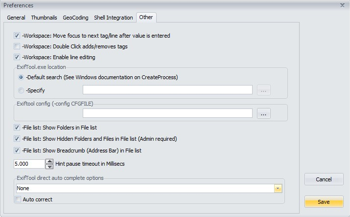 
  
<b><u>Other</u></b> settings tab 
 
<b>Workspace: Move focus to next tag/line after value is entered</b> 
By default, when you hit Enter button to confirm changing tag value in the Workspace, focus of selected tag/line automatically will
move to the next tag/line. If you prefer focus would remain on currently edited tag/line, then uncheck this option.  
<b>Workspace: Double Click adds/removes tags</b> 
If you check this, double-clicking in the Workspace will remove a tag,
double-clicking on one of the tabs Exif, Xmp, Iptc, Maker, All will add that tag to the Workspace.
  
<b>Workspace: Enable line editing</b> 
Enabling this option will allow direct editing in the Workspace. 
See edit <a href="#p_metadata">metadata</a> in Workspace.
  
<b>Exiftool.exe location</b> 
If you need to override the location of exiftool.exe you can do that here.
  
<b>Exiftool config</b> 
Use custom config. You can specify a complete path, or just the name. Refer to -config for more info.
  
<b>File list: Show Folders in File list</b> 
The default setting is to only show files in the File list panel. If you enable this option, also folders (directories) will be shown,
allowing easier navigation.  
<b>File list: Show Hidden Folders and Files in File list (Admin required)</b> 
Will also show hidden Folders and Files in the Folder Treeview and the File list panels. You need to be Admin to use this,
and not everything you see may be readable/writeable.  
<b>File list: Show Breadcrumb (Address bar) in File list</b> 
Enable a BreadCrumb bar on top of the file list. Allows for easier navigating.  
<b>Hint pause timeout in Millisecs</b> 
Hovering over the metadata panel will display the complete metadata value as a hint.
This was added because long values are often not completely visible. 
Setting this value to 0 (zero) will effectively disable the hints.
  
<b>ExifTool direct auto complete options</b> 
Here you setup auto appending, or suggesting, in the edit box of ExifTool direct. 
<ul>
<li>None: Dont use this feature.</li>
<li>Auto append: Appends characters as you type</li>
<li>Auto suggest: Suggests options as you type, by showing a dropdown list</li>
<li>Auto append+ suggest: Combines appending and suggesting</li>
</ul>
<ul><li>Auto correct: When the value entered matches a value from the list, corrects the casing (UPPER/lower case)</li></ul>

<u>Note:</u>To find the matches, the commands in the predefined list are used.
  
Example showing enabled auto complete: 
 
  

<h3><a name="m_workspace">Workspace manager</a></h3> 
Here you define what will be shown in the Metadata panel when Workspace is selected.
Besides ExifTool direct option, this is the most powerfull GUI feature. 
 
 
 
 
<b>Buttons</b> 
<ul>
<li>Add</li> 
Use this button to add a new line. The select tag name dialog pops up, where you can select a tag name.  
 
The tag is inserted after the currently selected line.  

<li>Delete</li> 
Deletes the currently selected line.  

<li>Defaults</li> 
Resets the settings to default. Warning. This removes all your current settings. 
With GUI V6.3.8 some autocomplete defaults were added. You may need this button to see them, when upgrading from a previous version. 
You can create a backup first using <a href="#m_export_import">Exporting and importing settings</a>  

<li>Arrow Up/Down</li> 
Use these buttons to move the selected line up, or down. 
Note: These buttons replace the dragging in previous versions. 
</ul>
 
<b>Default auto complete options</b>  
Here you specify the default auto complete options. These options will be used for all tags that have the auto complete option
set to <b>default</b>.
 
<ul>
<li>None: Dont use this feature.</li>
<li>Auto append: Appends characters as you type</li>
<li>Auto suggest: Suggests options as you type, by showing a dropdown list</li>
<li>Auto append + suggest: Combines appending and suggesting</li>  
<li>Auto correct: When the value entered matches a value from the list, corrects the casing (UPPER/lower case)</li> 
</ul>
<u>Note:</u>To find the matches for the default list, a list is built from all values loaded in the workspace. 
This list is not saved, and thus reset every startup of GUI.  

<b>Tag name column</b> 
Here you define the tag name to be displayed for a particular metadata tag. These tag names don't have any influence on the
actual tag names and you can write anything here, i.e. instead of "ISO", you can have "Noise maker" here. 
Tag names written here, can have different "behaviour" in case special character is used for their ending. For now,
GUI uses following ending characters: 
 

# -if tag name ends with this character (see Flash# and Orientation# above),
then the content of this tag will be displayed as usual. However, when modifying this tag, you need to enter a numerical value.  
&ast; -if tag name ends with this character (see Artist* above), then that means,
that value defined in Hint text will be used as default value for this tag.
In this case, if you right-click on Metadata panel (when in Workspace view mode),
pop-up menu appears and there's option Fill in default values -you get the idea, I hope.  
? -if tag name ends with this character (see Geotagged? above), then that means,
that you're not interested in the tag value itself, what you wish to see is, if a particular tag is defined or not. 
<u>Notes:</u> You won't be able to edit such a tag in Workspace view. 
Use 2 questionmarks ?? to show the value 0 as undefined.  
± -if tag name ends with this character (see Type± in main screenshot above),
then you'll be allowed to enter multiple values for single tag at once (i.e. keywords and similar).
Of course, you can't use this feature for any tag, so read the (Iptc &amp; Xmp) metadata documentation to findout what tags
support multi-values. 
Btw. you can get the ± character with Alt+0177 (typing 0177 on numerical keyboard, while pressing Alt key). 
 
<u>Note:</u> I might use further special ending characters in future, so try to avoid their usage at the end (or start) of tag names. 
 

<b>Tag definition column</b> 
Here you define tags as recognized by ExifTool. And if needed, you can
also add # character at the end of tag name -this will force displaying
numerical tag value (try with -exif:Orientation# to see the difference).
Of course, only one single tag can be defined per line. 
To separate group of tags in Workspace view, special "fake" tag is used: -GUI-SEP
(see "About photo" on above screenshot, and "Special tag names"). 
Note: It is recommended to prefix the tag names with a family 0, or 1, group name.
(EG: <b>-Exif:ISO</b>, or <b>-ExifIfd:ISO</b>, not just <b>-ISO</b>).This ensures that <a href="#m_popup_meta">marking</a> the lines defined in the workspace works best.  

Special tag names:
<ul>
<li><b>-GUI-SEP</b></li>Separate group of tags. 
<li><b>-GUI-INV</b></li>GUI detected an invalid tag, causing unpredictable results. 
<li><b>-GUI-HASH-MD5</b></li>Compute the MD5 hash of the file. Read only. 
<li><b>-GUI-HASH-SHA1</b></li>Compute the SHA1 hash of the file. Read only. 
<li><b>-GUI-HASH-SHA2</b></li>Compute the SHA2 hash of the file. Read only. 
</ul> 

<b>Hint text column</b> 
Text entered here is your <u>short</u> "private" help, which will be displayed in GUI's status bar when you start modifying tag value:  
  

<b>Auto complete options</b>  
You can override the auto complete options for a specific tag, by setting a value different from <b>default</b>.
Additionally you can specify a custom dropdown list, only used for this tag. Contrary to the default dropdown list, the
custom dropdown list is saved to disk. 
 
<ul>
<li>Default: Use the default setting of the Workspace.</li>
<li>None: Dont use this feature.</li>
<li>Auto append: Appends characters as you type</li>
<li>Auto suggest: Suggests options as you type, by showing a dropdown list</li>
<li>Auto append + suggest: Combines appending and suggesting</li>  
<li>Auto correct: When the value entered matches a value from the list, corrects the casing (UPPER/lower case)</li>
<li>Auto populate: Any value typed in manually in the Workspace will be added to this list.</li> 
</ul>
Auto complete example of <b>FNumber</b>:  
  
How it looks in the Workspace by just typing a '1':  
  

 
I hope you can recognize the power of Workspace manager:
 YOU define any metadata tag you wish to change regularly.  

<h3><a name="m_export_import">Exporting and importing settings</a></h3> 
The settings you make for the Workspace, ExifTool direct, File list, Custom view and predefined tags
are automatically saved into <b>ExifToolGUIv6.ini</b> file when GUI is closed.
So, next time you start GUI, those settings are preserved. 
Using the export and import functions, you can create a backup of your settings, to transfer them to another computer,
or switch the view when switching media types. EG Camera RAW to Video.  
  

<h4>Program/Export</h4> 
  
Check the settings to include in the ini file. 
 
When you choose OK, you'll be asked where to save the file and you'll need to set the filename.
By default, save directory will allways be the directory where ExifToolGUIV6.ini is saved;
however, you can choose any other directory. 
And if you've messed with your Workspace inbetween, you can choose to import the settings from ExifToolGUIV6.ini file.
Which simply imports all settings from last GUI session. 
 
When saving, the name of the Workspace definition file can not be ExifToolGUIV6.ini.
You should use any name that reminds you on content, for example: MyWorkspace_XMP.ini. 
 

<h4>Program/Import</h4> 
When you choose Import, again, the default starting directory will be the one, where ExifToolGUIV6.ini
is located. Starting with V6.3.8 all selected settings are exported in one (1) ini file. The Import function imports all settings
found in the ini file. 
Upon succesful import a dialog is displayed, showing the settings imported from the file.  
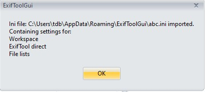  

  
<h3><a name="m_style">Style</a></h3>
 
Shows a list of available style/skins. To change the appearance of GUI. 
 
 
 
The Styles Silver, Green and Blue try to mimic the colors available in V516
 

<h2><a name="m_options">Options menu</a></h2>

<h4>Don't make backup files</h4>
-if checked (default), then ExifTool won't make "filename.ext_original" backup files. However, if you're not sure what you're doing,
then you better uncheck this option. 

<h4>Preserve Date modified of files</h4>
-no matter what I think about this, some prefer having this option checked. 

<h4>Ignore minor errors in metadata</h4>
-by default, this option is unchecked. This results, in case metadata is not "as it should be", ExifTool will output
warnings/errors messages when trying to modify such metadata. That is, ExifTool will refuse to write into file in case metadata is
not in "perfect" condition, or if there's a danger that you might lose some metadata by modifying it. 
If this option is checked and metadata only contain "minor" errors (or only "minor" damage can occur),
then ExifTool will do his job anyway. 

<h4>Show Exif:GPS in decimal notation</h4>
-checked by default (because i.e. OSM Map uses this notation as well). 

<h4>Show sorted tags (not in Workspace)</h4>
-if this option is unchecked (default), then metadata tags are shown sorted as defined internally in metadata.
Many times however, it's quite  hard to find particular tag in listing, so I can imagine, that this option will be checked
most of the time. 
Obviously, this setting has no influence on Workspace view output
(see Workspace manager above). 

<h4>Show Composite tags in view ALL</h4>
Composite tags aren't "real" tags (their values are calculated from various existing tags), so they are shown optionally. 

<h4>Don't show duplicated tags</h4>
It can happen that the same tag is defined more than once inside image file and by default, GUI will show all of them.
If you don't like this behaviour, then check this option, but warning:
some other tags might also not be shown! 
Try with Exif GPS data, for example. 
 
All above options will be saved when exiting GUI and thus be applied at next GUI start. Remaining options settings however,
are only temporary (as long GUI is running) and are not checked by default: 

<h4>Show tag values as numbers</h4>

<h4>Prefix tag names with ID number</h4>

<h4>Group tag names by instance(-g4)</h4>
-This can help you to identify duplicated tags when viewing in Metadata panel. 

<h4>API WindowsWideFile (requires Exiftool V12.66</h4>
-Force the use of wide-character Windows I/O functions when the CharsetFileName option is used  Default checked. 

<h4>API WindowsLongPath (requires Exiftool V13.02)</h4>
-Adds support for Windows Long Path names. File names longer than MAX_PATH (260 chars). Default checked. 

<h4>API LargeFileSupport (requires Exiftool V12.88)</h4>
-To process files larger than 2GB. Video's for example. Default checked.  
Link to all ExifTool <a href="https://exiftool.org/ExifTool.html#options">API options</a>

<h4>Expand file names</h4>
-When checked GUI passes the full path name to ExifTool. Default unchecked. 

<h4>Custom options</h4>
-You can specify additonal options that exiftool should use.
Expert option. Normally used with the Log Window. 
Possible use case is adding an API option <b>-API WindowsLongPath=1</b> 
 

<h2><a name="m_exp_imp">Export/Import menu</a></h2>  
<h3><a name="m_exp_meta">Export metadata into : TXT, MIE, XMP, EXIF, HTML files</a></h3>
Each format has a different purpose: i.e. MIE is for making backup of complete metadata inside image file,
HTML is meant for "studying" metadata structure, etc. So, try and see what suits your needs. 
 

<h3><a name="m_copy_meta_single">Copy metadata from single file</a></h3>
This will copy metadata from single source file (can be MIE file too) into currently selected files. That is,
all selected files will be populated with the same metadata. After you choose the source file,
you'll have a chance to reduce the amount of metadata to be copied:  

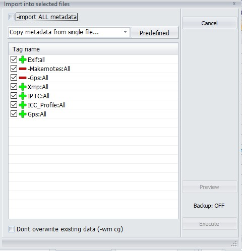 
 
<u>Notes:</u>
<ul>
    <li>A <b>Grayed</b> Plus or Minus means the tag is <b>not selected</b> for processing.</li>
    <li>A <b>Green Plus</b> means the Tag is <b>selected</b> for processing and the tag will be copied</li>
    <li>A <b>Red Minus</b> means the Tag is <b>excluded</b> for processing and the tag will not be copied</li>
     
    Technically: For every Tag selected a - (minus) is prefixed and passed to ExifTool.  
    A Tag name that begins with a - (minus) will result in -- (2 minus) and function as an exclusion. 
    The selection in the screenshot would result in: 
    <pre>-Exif:all --Exif:Makernotes --Gps:All -Xmp:all -Iptc:All -ICC_Profile:All -Gps:All</pre>
    <li>To verify your selection use the <b>Preview</b> button.</li>
    <li>Your selection (The tags that you have checked) will be remembered and proposed next time.</li>
</ul>
 
See also: 
<a href="#p_managemetadata">Managing metadata</a> how you can customize the predefined lists and tags. 
<a href="https://exiftool.org/exiftool_pod.html#Tag-operations">Tag-operations</a> ExifTool documentation on Tags. 
 

<h3><a name="m_copy_meta_jpgtiff">Copy metadata into JPG or TIF files</a></h3>
If a single (JPG or TIFF) file is selected (=destination), then metadata can be copied from any other file containing metadata
(incl. MIE file). 
If multiple files are selected, then metatada will be imported only where source and target files have equal names. 
 
More details on how it works: 
As always in GUI, before you choose menu, you select one or multiple JPG (or TIFF) files. This are the destination files.
Now you select the menu and, no matter how many destination files you've selected previously,
you'll be asked to choose only one source file (see 2nd scenario). Now, there can be two scenarios: 
<b>Scenario 1:</b> If you selected only <u>one JPG or TIF destination file</u>: 
All metadata from source file will be copied into destination file. And while destination file can only be JPG or TIF,
the source can be any kind of imagefile (raw, etc.).
To put it simple: it's just copying all metadata from any kind of file into JPG (or TIF) file. 
<b>Scenario 2:</b> If you selected <u>multiple JPG or TIF destination files</u>: 
Now, you do remember by picking only one source file... in this case, you actualy didn't choose particular source file,
but extension(!) of source files and folder where source files are. After executing, Exiftool only compares source/destination
filenames, and where filenames match, metadata is copied. To put it simple: it's just copying all metadata between files which have
 equal filename (but can have different extension). 
Scenario 2 is very useful in case you have converted many raw files to JPG/TIFF and you know, that your raw converter doesn't
copy all metadata from raw into resulting JPG/TIF files. 
 
<u>Note:</u> Because it's assumed, that the destination file has been modified inbetween (resized, etc.),
not all metadata is desired to be copied. Because of this, you'll be asked, if you also wish to copy following tags:  
 
 
-in 99% of the cases, there will be no reason to check any of above option. 
 
<h3><a name="m_copy_meta_all">Copy metadata into all JPG or TIF files</a></h3>
This option is very similar to above. The difference is: 
<ul>
    <li>No matter how many destination files you select (you must select at
    least one for menu to be enabled), metadata will always be copied into <b>all</b>
    JPG or TIF (but not both) files inside current folder. That is,
    this option behaves as if all JPG or TIF files are selected in <b>Scenario 2</b> above.</li>
    <li>After you choose this menu option, you'll be first asked
    "should files in subfolders also be processed?".
    If we choose No, then again, this option behaves the same way as if all files are selected in
    <b>Scenario 2</b> above. However, if we choose
    Yes, then metadata will be copied into images in all subfolders as well
    (only where folder/file names are equal, of course).</li>
</ul>
 
Let's see an example, where we wish to update jpg
files with metadata from raw files: 
 
 
 
<ol>
    <li>Select any destination file inside MyJpg\Dir1
    folder. If you select any JPG file, then only JPG files will be processed; if you select TIF instead,
    then only TIF files will be processed.</li>
    <li>Choose menu Copy metadata into all JPG or TIF files</li>
    <li>Click on Yes button when asked</li>
    <li>The File browser will appear, where you select any (source) file inside MyRaw\Dir1 folder.
    <u>Note:</u> You only need to select one file (to specify file extension).</li>
    <li>A panel will appear, where you confirm/check which "undesired" metadata you <u>wish</u> to be copied:</li>
</ol>
 
 
 
<u>Note:</u> Even if none of above is checked, the rest of metadata in source files (Exif, Xmp, etc.)
will be copied into destination files. 
 
That's it: by clicking on Execute, metadata will be copied into all files inside
MyJpg\Dir1 folder (incl. Dir2 folder) from files inside
MyRaw\Dir1 folder (incl. Dir2 folder). 
If we would choose No in step 3 above, then only files inside
MyJpg\Dir1 would be processed. 
 
See also: <a href="#p_managemetadata">Managing metadata</a> 
 
<h3><a name="m_import_gps_log">Import GPS data from: Log files</a></h3>
 
This option allows geotagging your files in batch by using log file of your GPS device
(see here for <a href="https://exiftool.org/geotag.html">supported GPS files</a>).  
 
  
<u>Step 1:</u> <b>Select log file</b> of your GPS device. 
As usual in GUI, you first must select files you wish to geotag. In most cases, folder contents will contain series of
"session" photos, so you will select all of them. 
 
<u>Step 2:</u> Check <b>use all log files in directory</b> if more than one log file for set of files exist. 
Let's say you've made a three day trip to Venice. In such case all photos will reside in single folder,
but three (or more) log files will exist for that set of photos. 
Note: In this case, it doesn't matter which (of multiple) log file you choose. Important is, all log files
must have the same extension. 
 
<u>Step 3:</u> Optional: Show on Map. Use this to visually check the log files.</b>. 
<u>Step 4:</u> Choose <b>Reference DateTime value</b>. 
Here you define which photo DateTime values to compare with those in log file. 
 
<u>Step 5:</u> Margin before or beyond Track. Change this if the time of your images is not within 1800 secs (default)
of the track time. 
<u>Step 6:</u> Choose if <b>TimeZone offset</b> is needed to be taken into account. 
This is a funny one... The thing is, log files contain UTC time, while a camera is usually set to local time
(where the photo is taken). In most cases, we are dealing with two scenarios: 
<ul>
    <li>Case A: Photos are taken in your local (time) area 
    -in this case there's no need to use TimeZone offset option. Short explanation: if TimeZone offset option doesn't exist,
    ExifTool "assumes" that camera time and PC's system time have the same TimeZone offset and ExifTool will handle the logged UTC time
    automatically.</li>
    <li>Case B: Photos are taken somewhere outside your local TimeZone area 
    -in this case you must use TimeZone offset option. Example: if you live in New York and the photo was taken in Vienna,
    then you must set TimeZone offset to +01 (depending on winter/summer time?)</li>
</ul>
In both cases above it's assumed, that camera is set to local time of where photos are taken. It's also assumed,
that when geotagging, your PC/laptop is set to your local (home) TimeZone. 
For further reading/questions see <a href="https://exiftool.org/forum/index.php/topic,3333.0.html">here</a>.  
<u>Step 7:</u> Check Update Geo Location, if you wish to update Country, Province and City. 
Click on <a href="#m_geotag_setup"><b>Setup Geo</b></a> to control how these fields are filled. 
Note: These fields are also shown in the file list if it's set to 'Location info'. 
 

<h3><a name="m_import_gps_xmp">Import GPS data from: Xmp files</a></h3>
By using this menu, you can copy GPS data from xmp sidecar files into Exif GPS section of selected image files. 
<u>Note:</u> It is expected that image and sidecar files only differ in extension. The name part however, must be equal.
Examples of valid image-sidecar file pairs are: 
 
MyPhoto.jpg - MyPhoto.xmp or MyPhoto.jpg.xmp 
img_01.cr2 - img_01.xmp or img_01.cr2.xmp 
etc.  

Because image and sidecar files usually reside in the same folder (that is, they are mixed), it is a good idea to use
the file type filter (which is set to "Show ALL files" by default). That is, if you wish to write GPS data into JPG files,
you should set filter to "JPG files only". However, this setting is not required!  
Workflow is like this: 
<li>Sort files by file extension (so, for example, JPG and XMP files are grouped -not mixed) or use desired file type filter
(i.e. "CR2 files only"). The only reason for doing this is: you can select (only) image files easier.</li>
<li>Select all image files you wish to modify.</li>
<li>After choosing menu <b>Import GPS data from xmp file(s)</b>, you'll be prompted to select folder containing (xmp) sidecar files.
In most cases, that will be the same folder where image files reside.</li>
...and that's it. 
 

<h3><a name="m_extract_previews">Generic extract previews</a></h3>
As you may know raw image files can also contain a JPG image, which serves for previewing raw image file content.
In most cases, this JPG image is "as if photo would be taken in JPG mode" -while this is true for exposure and colors,
resolution (pixel size) may differ (depends on camera). 
Because there are many flavours possible I created a generic function.
It shows, for the selected file, what previews are available, and their sizes. 
You can check which preview(s) to extract and optionally perform autorate, and or crop.  

  

<h3><a name="m_import_preview">Generic import preview</a></h3>
Use this option to update a preview. Before you choose this option select in the file list which files to update. 
In this dialog select which preview to update. Optionally rotate and or crop. 
When you click on <b>Execute</b> browse to the folder containing the previews. The previews should have
the same base name as the raw files. Typically they are created by the previous option.  

 
 
See also the readme.<a href="Readme Lossless rotate_Import_Export previews.txt">Readme Lossless rotate_Import_Export previews.txt</a> 

<h2><a name="m_modify">Modify menu</a></h2> 

<h3><a name="m_date_shift">Exif/Xmp: DateTime shift...</a></h3>
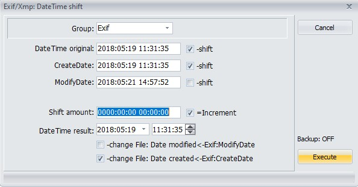 
  
Typical usage of this function is when you've forgotten to update the time of your camera when daylight savings has changed,
or when you've moved to a different timezone. And all you photo's are 'off' by the same amount of time. 
Notes:
<ul>
    <li>The date and times shown are from the first selected file, and are only displayed to help you calculate the <b>Shift amount</b></li>
    <li>All selected files will be shifted using the <b>Shift amount</b></li>
    <li>Modifying <b>DateTime result</b> will calculate the <b>Shift amount</b> for you.</li>
    <li>By checking the checkboxes <b>change File</b> the date time shown in Windows explorer will also be updated.</li>
</ul>  
<h3><a name="m_date_equal">Exif/Xmp: DateTime equalize...</a></h3>
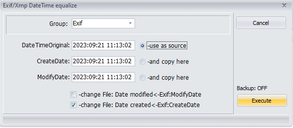 
 

<h3><a name="m_exif_lensinfo">Exif: LensInfo from Makernotes</a></h3>
This will fill Exif:LensInfo of selected file(s) with relevant values from
Makernotes data (where possible). 
You can use this function if the <b>Camera settings</b> doesn't show <b>LensModel</b>, but the data is available in the Makernotes. 
 

<h3><a name="m_remove_meta">Remove metadata</a></h3>
 
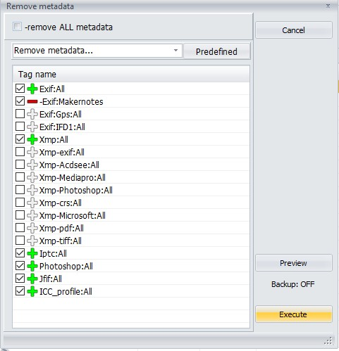 
 
<u>Notes:</u>
<ul>
    <li>A <b>Grayed</b> Plus or Minus means the tag is <b>not selected</b> for processing.</li>
    <li>A <b>Green Plus</b> means the Tag is <b>selected</b> for processing and the tag will be deleted</li>
    <li>A <b>Red Minus</b> means the Tag is <b>excluded</b> for processing and the tag will not be deleted</li>
     
    Technically: For every Tag selected a - (minus) is prefixed and a = (equal) suffixed and passed to ExifTool.  
    A Tag name that begins with a - (minus) will result in -- (2 minus) and function as an exclusion. 
    The selection in the screenshot would result in: 
    <pre>-Exif:all= --Exif:Makernotes= -Xmp:all= -Iptc:All= -PhotoShop:All= -Jfif:All= -ICCprofile=</pre>
    <li>To verify your selection use the <b>Preview</b> button.</li>
    <li>Your selection (The tags that you have checked) will be remembered and proposed next time.</li>
    <li>In some cases (depending on the image file format), it's not possible/safe to remove the metadata you've selected to remove. 
    In such cases, ExifTool will simply refuse to remove such metadata (also see
    Ignore minor errors in metadata menu above). </li>
</ul>
 
See also: 
<a href="#p_managemetadata">Managing metadata</a> how you can customize the predefined lists and tags. 
<a href="https://exiftool.org/exiftool_pod.html#Tag-operations">Tag-operations</a> ExifTool documentation on Tags. 
 

<h3><a name="m_update_geoloc">Update City, Province, Country from GPS coordinates</a></h3>
This option can update the location info (Country, Province and City) for the selected files. 
The selected files should already be geotagged, that is contain lat and lon values. 
For every selected file a lookup is done using the selected provider. To reduce the nbr of calls a cache is used. 
In the dialog you can customize how the fields are filled.  
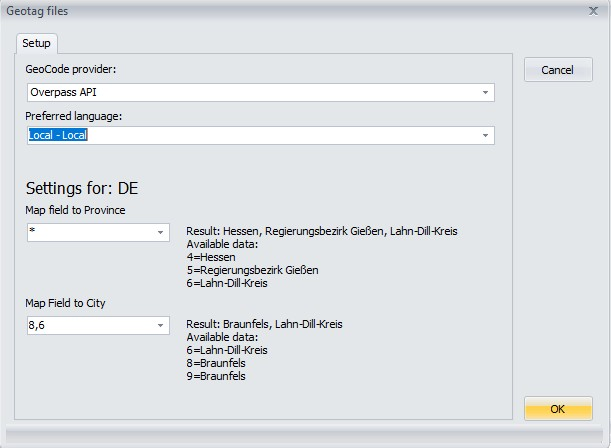  
<u>Notes:</u> 
- If you use Gecode provider 'Exiftool geolocation' no internet connection is required. 
- The other providers use an external webservice, and thus there are some 'point of failures'. 
<ul>
    <li>You need a reliable internet connection.</li>
    <li>The external webservice could be (temporarily) out of service for various reasons.</li>
    <li>The external webservice might change it's API.</li>
    <li>etc...</li>
</ul>
- If you open the log window you can see the rest requests and their responses.  
<a href="Readme GeoCoding.txt">See also Readme GeoCoding.txt</a> 

<h3><a name="p_managemetadata">Managing metadata</a></h3>
 
Starting with V6.3.5 the functions
<a href="#m_modify">Modify/Remove metadata</a> and
<a href="#m_exp_imp">Export/Import Copy metadata</a>
are capable of: 
 
<ul>
    <li>Saving and restoring (remembering) the selected tag names.</li>
    <li>Previewing which tags will be processed.</li>
    <li>Customizing the tags to process, by creating your own predefined lists.</li>
</ul>
 
  
<li>A button <b>Preview</b> has been added. It will give you a preview of the selected tag names, with their values.</li>
 
<u>Notes:</u>
<ul>
    <li>When removing metatadata the displayed tags are the tags to delete, when copying metadata the tags to copy.</li>
    <li>To display the preview GUI uses the Log Window.</li>
    <li>The data (Tag names and values) shown are from the first selected/source file.</li>
</ul>
 

  
 

<h3><a name="p_predefined_lists">Managing pre defined lists</a></h3>
<ul>
    <li>You can customize the tags, by clicking on the button <b>Predefined</b>. 
    This will open the form <b>Predefined Tags</b>.</li>
     
    <li>The buttons on top allow you to <b>Add/Delete/Add/Duplicate</b> a predefined list. 
    This predefined list can be chosen when removing, or copying metadata, and will be remembered. 
    The button <b>Defaults</b> can be used to reset the predefined lists to their defaults.</li>
</ul>
 
  
 
<ul>
    <li>The buttons in the middle <b>Delete/Edit</b> will remove/modify the selected tag.</li>
    <li><b>Add</b> will open a new form where you can select a tag.</li>
</ul>
 
  
 
<ul>
    <li>You can choose 3 modes:</li>
    <ul>
        <li>From sample. Select a Tag that exists in the sample file, along with the values.</li>
        <li>All writeable tags. Select a Tag from the list that ExifTool supports for writing.</li>
        <li>Free choice. You can type in anything you like in the Edit box <b>Selected Tag name</b>.</li>
    </ul>
     
    For the first 2 modes you first have to select a <b>Family</b>. 
    Then you can choose a <b>Group</b> from that family. 
    And lastly a <b>Tag</b> from that group.  
    Notes:
    <li>The Comboboxes <b>Group</b> and <b>Tag</b> support full text search. That is typing a text filters the dropdown list.</li>
    <li>The built Tag name will always be in the form Group:Tag. Except when you choose Free choice. 
    If <b>Exclude Tag</b> is checked the tag will be prefixed by a - (minus), to serve as an exclusion.</li>
     
</ul>
<a href="https://exiftool.org/#tagnames">See here for more info how tag names are build up.</a>
   

  
 
<li><b>Ok</b> will add the newly created tag after the selected tag.</li>
  
<u>Note:</u> 
When you're done modifying the predefined tags, you can export and import them using: 
<a href="#m_predefinedfile">Predefined tags definition file Load/Save</a>.

<h2><a name="m_various">Various menu</a></h2>

<h3><a name="file_datecremod_as_exif">File: Date created and modified as in...</a></h3>
<ul>
<li>Exif</li>
<li>Xmp</li>
<li>QuickTime</li>
</ul>

Use it, if you feel the need.  
This is a remark originally made by Bogdan. I would like to add my comment why it's not a good idea. 
If you have a backup tool that relies on the Date Modified, it will not notice that a file is modified. Example: Robocopy 

 
<h3><a name="name_datetime">File: Name=DateTime+Name</a></h3>
 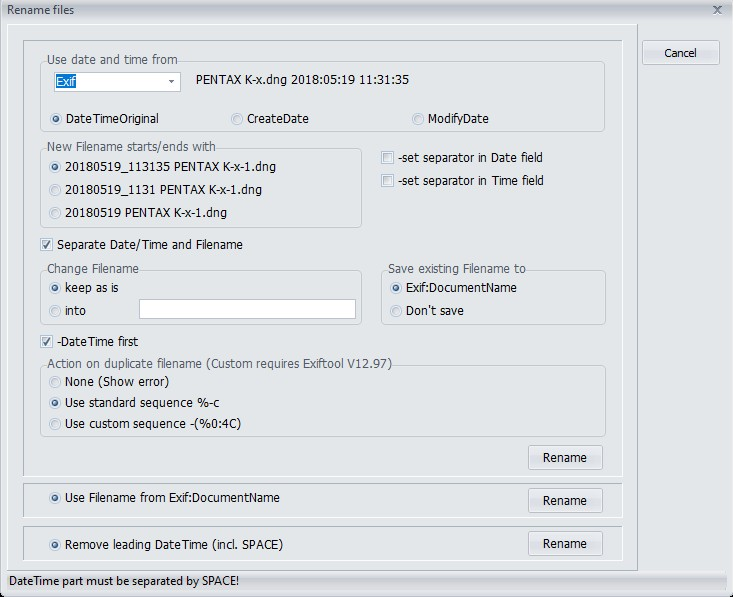 
 
This function enables you to rename files, using any of the metadata dates in Exif, or XMP. 
Exif is mostly used for JPG, Tiff or Raw files, XMP for Sidecar files. 
To help you choose:
<ul>
    <li>DateTimeOriginal</li>
    <li>CreateDate</li>
    <li>ModifyDate</li>
</ul>
first select a file in the file list, and a preview will be shown using the date found.  
You have multiple options to control how the new file name(s) should be. Gui tries to show a preview of the final result,  
but the actual renaming is performed by ExifTool. 
If you dont keep "Change Filename" "keep as is", renaming could result in duplicate filenames.
The default is to add a "-1, -2", (%-c option of Exiftool) to the filename, but starting from ExifTool 12.97, you can also specify a custom sequence.

<h3><a name="jpg_lossless_rotate">JPG: Lossless autorotate + crop</a></h3>
This will physically rotate selected JPG images according to Exif:Orientation value inside files. 
It uses a library NativeJpg by SimDesign B.V. to do the actual rotating. No external program is needed. 
In addition you have more control over how the function is performed.  
  
<a href="Readme Lossless rotate_Import_Export previews.txt">See also Readme Lossless rotate_Import_Export previews.txt</a>
 
 

<h3><a name="create_hash_files">Create Hash files...</a></h3>
For all selected files Hashes will be computed and saved in a separate file with the extension of the selected Hash method. 
Gui supports these methods:
<ul>
<li>MD5</li>
<li>SHA1</li>
<li>SHA2</li>
</ul>
 

<h3><a name="select_left_diff">Select left diff</a></h3>
This option allows you to specify the file, or directory to use on the left side of the compare window. 
 

<h3><a name="show_diff_metadata">Show diff metadata</a></h3>
<h4>Accessing the Show diff metadata form</h4>
<ul>
<li>Select 1 file or directory, and click on <b>Show diff metadata</b>, from the various menu, or the context menu of the file list. 
The selected file/directory is used on the <b>left side</b>. You will be prompted for a <b>right side</b>.
</li>
<li>Select 2 files or directories. Clicking on <b>Show diff metadata</b> opens the <b>Show diff metadata</b> form directly.</li>
<li>Select 3 or more files. Clicking on <b>show diff metadata</b> prompts for the <b>right</b> directory</li>
</ul> 
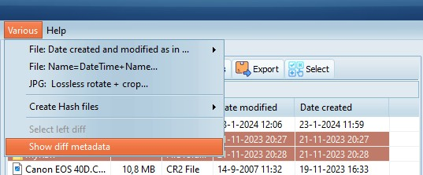  
  
<ul>
<li>You can control what is shown on the left side, by clicking <b>Select left diff</b> first.</li>
</ul>
  

The <b>Show diff metadata</b> form opens.  
  

The <b>Show diff metadata</b> form has these options: 
<ul>
<li>Include/Exclude the tags to compare, and save them as default. 
The list of tags is shared with the lists used for removing and copying metadata, 
and can be saved and loaded using <b>Program/Predefined tags definition file</b>. 
See <a href="#p_predefined_lists">Managing pre defined lists</a> how to customize these lists. 

 </li>
<li>Formatting options. (-v, -n, -g, specify the family group name)</li>
<li>When comparing 2 directories specify how to match the filenames.</li>
</ul>
 
It also offers to <b>merge</b> the changes between 2 files. 
<ul>
<li>Click on the <b>buckets</b> to delete selected groups/tags from the <b>left</b>, or <b>right</b> side. 
(For every selected tag a <b>-tagname=</b> is executed either on the <b>left</b>, or <b>right</b> file.) 
</li>

<li>Click on the <b>Arrows</b> to copy the selected groups/tags from the <b>left</b> to the <b>right</b>,
or <b>right</b> to the <b>left</b> file. 
(A <b>-tagsfromfile</b> is executed using the selected tags.) 
</li>
</ul>

<h2><a name="m_help">Help menu</a></h2>
<h3>Online Documentation</h3>
-Opens this document 

<h3>Check versions</h3>
-Check for updated versions of GUI and ExifTool  

<h3>About</h3>
-Displays ExifTool and GUI versions and links. 
 

<h2><a name="p_preview_regions">Preview/Regions</a></h2>
<h3>The preview tab</h3>
The preview tab shows a preview of the selected file. The preview is generated by W(indows) I(maging) C(omponent).
WIC needs a codec to be able to generate the preview. For most commonly used file types Windows (11) provides codecs.  

<h3>The regions tab</h3>
Clicking on the <b>regions</b> tab allows you to display and edit the regions, provided that a preview can be shown.  

  
<b>Viewing:</b> 
<ul>
<li>Select a region from the list.</li>
<li>The selected region will be displayed with solid lines, not selected regions will be displayed dotted.</li>
<li>Only checked items will be shown on the image.</li>
<li>Info on the selected region will be displayed at the bottom, and can be edited.</li>
<li>Use the Maximize button (The rightmost button, right from the Save button) to show the image maximized within the GUI window.</li>
</ul> 

<b>Adding/Editing:</b> 
<ul>
<li>If a region is available and selected, you can edit that right away.</li>
<li>To add a new region, and start editing that, click on the <b>+</b> to define a new region. A number <b>#1, #2</b> etc. appears.</li>
</ul> 

<ul>
<li>You can define a region by selecting a rectangle with the mouse while holding the left button.</li>
<li>Alternatively you can enter values for the X/Y W/H fields. Either by typing a value, using cursor up/down, or mouse wheel.</li>

<li>You can assign a Name, Description and Type.</li>
Name and Description are optional, and may not be provided, or recognized, by other software. 
Type is mandatory. Valid values are <b>Face</b>, <b>Pet</b>, <b>Focus</b> and <b>BarCode</b>. 
</ul> 

<b>Notes:</b> 
The X and Y values define the top left corner of the region. 
The W and H values define the width and height of the region. 
<ul>
<li>As a percentage divided by 100, of the Width and Height of the image in pixels.</li>
<li>All values should be in the range 0 to 1.</li>
<li>The decimal separator used on-screen conforms to your Windows regional settings.</li>
<li>The decimal separator read from, and written to, the file conforms to XML standards. (always a period .)</li>
<li><b>Before</b> rotation is performed.</li>
</ul> 

<b>Deleting:</b> 
<ul>
<li>Simply click on the bucket.</li>
</ul> 

<b>Saving your changes:</b> 
<ul>
<li>When done press the <b>Floppy</b> icon to save your changes.</li>
<li>Selecting another, or the same, file discards the changes, without a warning!</li>
</ul>
 

<b>Keyboard shortcuts</b> 
<ul>
<li><b>CTRL/R</b> Switches between the <b>Preview</b> and the <b>Region</b> tab.</li>
<li><b>CTRL/S</b> Saves changes to the file.</li>
<li><b>CTRL/I</b> Adds a new region to the file.</li>
<li><b>CTRL/Up Down</b> Selects the Previous/Next file.</li>
<li><b>ALT/Up Down</b> Maximizes/Restores the size of the image.</li>
<li><b>ESC</b> Restores the size of the image.</li>
</ul>

<h2><a name="p_filelist">File list panel</a></h2>
<h3>Changed with Version 6.3.6.</h3>
 
The (dropdown) buttons on top of the file list replace the previous combo boxes. For the most part this should be self explanatory.  
 
 
<b>Notes:</b>  
<li>The text 'Standard file list', and 'Show All Files' will change if you select an other option.</li>
<li>The Breadcrumb bar is shown only when enabled in Preferences/Other.  </li>
 

<li><b>Refresh button</b></li> 
Will update folder (directory) content in file list panel. This might be
 useful in cases you're interested on file characteristics changes
(size, etc.) after applied operations. 
 

<ul>
    <li>Standard File List / (96pix) button</li> 
     
     
    As said the text and the icon of this button changes to reflect what is chosen. Also a small black circle marks the current
    selection. Your selection will be saved and restored. 
     
    This button has 3 functions: 
    <ul>
        <li>Select Thumbnail mode, in 5 sizes. (256pix and 512pix added)</li>
        <li>Select the detail mode. (Standard, Camera settings, Location info, About photo and User Defined)</li>
        Note You can now add as many User defined lists as you like. 
        <li><b>Configure</b> This opens a new form where you can customize the field list of the details.
        More on this later. see: <a href="#p_config_file_list"><b>Configure file list columns</b></a>
        </li>
    </ul>
</ul>
 

<li><b>Show all files button</b></li> 
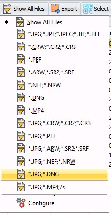 

 
Note: The screenshot shows the new V6.3.6 default file filters.
They can be added with the button <b>Defaults</b> in the <b>Configure</b> form. 
 
The working principle is the same as the File list details button. You can choose a filter that has been defined.
Selecting a filter will filter the File list. Like V6.3.5. and earlier. 
 
<a href="#p_config_file_filter"><b>Configure</b></a> opens the <b>Configure file filters</b> form:  
 
2 new functions have been added:  
<ul>
    <li><b>Select/'Select all'/'Select none'</b> to quickly select all files. The shortcut CTRL-A works also in the file list.</li 
    <li><b>Export/Csv/Json</b> Create an export file with all data in the file list.</li>
</ul>

  
<h3><a name="p_file_list_layout">File list layout</a></h3> 
  

<h3><a name="p_config_file_filter">Configure file filters</a></h3>
 
  
This is the form that previously opened when you clicked Edit. Changed with V6.3.6:
<ul>
    <li>Layout has been changed.</li>
    <li>You can update an entry.</li>
    <li>You can restore the defaults.</li>
    <li>You can check which entry should be used at startup. Previous versions always started with <b>Show All Files</b></li>
</ul>
 

 
Note: The <b>Configure file filters</b> form also allows enabling sub folders in the file list, by adding <b>;/s</b>.
See: <a href="#p_subfolder">Enabling Subfolders in the File list</a> 
 

<h3><a name="p_subfolder">Scanning and displaying sub folders in the file list</a></h3>
 <b>Prerequisite</b>
<ul>
    <li>Enable <b>Show folders</b> in <b>Preferences</b> 
    Sub folders will only be shown when this option is enabled. </li>
</ul>
 <b>Enabling</b>
<ul>
    <li>Open the <a href="#p_config_file_filter">Configure file filters</a> form</li>
    <li>Add an entry with <b>/s</b>  
      
    A File filter consists of entries separated by a semicolon 
    Each entry specifies a mask, or the modifier '/s'. 
    A mask can contain literal characters, or special characters like *, [-] or ?. 
    </li>
</ul>
 

<b>Sample file filters</b>: 
<table border="1">
<tr><td>Typical usage</td><td>*.jpg;*.mp4</td><td>Show Jpg and mp4 in current folder</td></tr>
<tr><td></td><td>*.jpg;*.mp4;/s</td><td>Show Jpg and mp4 in sub folders</td></tr>
<tr><td>All Files</td><td>*.*;/s</td><td>Time consuming!</td></tr>
<tr><td>Advanced</td><td>[A-Z][A-Z][A-Z][A-Z][0-9][0-9][0-9][0-9].jpg;/s</td>
<td>IMGP0001.jpg (first 4 chars need to be A-Z, last 4 chars need to be 0-9)</td></tr>
</table>
 
For more info on the file filter see the Embarcadero documentation on the Delphi function:
<a href="https://docwiki.embarcadero.com/Libraries/Athens/en/System.Masks.MatchesMask">MatchesMask</a>
 

 <b>Usage</b> 
<ul>
    <li>Select a file filter that has the '/s' modifier and sub folders are scanned.
    Obviously this can take longer, so you will see a progress form, with a button <b>Close</b>. 
    <b>Close</b> will stop the scannning.  
     </li>
     
    <li>Folder names are only shown the next level relative to the selected folder.</li>
     
    <li>File names are shown until no more files are found matching the pattern.</li>
     
    <li>Most functions are available on the (sub)files shown, with these 2 exceptions:
    <ul>
        <li>A context menu (right click) can not be shown when multiple files from different subdirectories are selected. 
        dir1\sub\a1.jpg and dir1\sub\a2.jpg can be combined, but not with dir1\a.jpg</li>
        <li>Export/Import Copy metadata into all JPG or TIF files... is disabled. 
        This function can work on subdirectories, so that would be confusing.</li>
    </ul>
    All other functions, including ExifTool Direct, Metadata panel, OSM panel work as expected.</li>
     
    <li>Column sorting (Activated by clicking on the column header) 
    <ul>
        <li>
        In thumbnail mode the sort order is always Folders first, followed by files. The relative name is used for sorting. 
        This can not be changed. 
        Relative name = The name relative to the currently selected path. (E.G. subdir1\subdir2\file1.jpg) 
        </li> 
        <li>
        In detail mode you can use column sorting. 
        But beware of the performance considerations combined with subfolders containing many files. 
        <ul>
            <li>Standard file list. 
            This works relatively fast on all columns.  </li>
            <li>Camera details, Location info, About photo. (Read mode=internal) 
            When sorting is active on Filename this is also relatively fast. 
            Sorting on other columns force GUI to get the details of all files selected, this will be much slower.  </li>
            <li>User defined (Read mode=ExifTool) 
            Sorting on Filename is also relatively fast, any other column will be an excercise in patience. 
            GUI has to execute ExifTool for all files found to get the details.
            It does that in Stay_open mode, multi-threaded, but nevertheless it's time-consuming.</li>
        </ul>
    </ul>
</ul>

  
 <b>Sample detail mode:</b>  
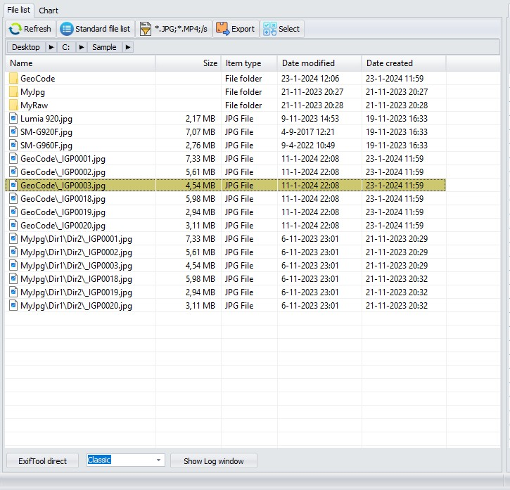 

  
Developer note: Bogdan Hrastnik used JAM Shellbrowser for the file list, and folder list. I wanted to have sourcecode that did not rely on 3rd party libraries. The additional functionality needed for
ExifToolGui required extending the standard Embarcadero TShellTreeView and TShellListView. It proved to be more difficult than I anticipated. By now it works satisfactory. 
A few small modifications to the Embarcadero source are needed. You can find the ReadMe and source code in GitHub. 
<a href="..\Source\Vcl.ShellControls\ReadMe.txt">ReadMe ShellControls.txt</a>
  

<h3><a name="p_config_file_list">Configure File list columns</a></h3> 
This is a totally new form and replaces the old 'Edit' button form.  
The form shown in previous versions: 
 
  
 
The form shown in V6.3.6 and later: 
 
  
 
The new form gives you more options.  
<ul>
    <li>The columns for Camera settings/Location info and About info can be customized.</li> </li>
    <li>You can define multiple user defined lists. Duplicate, Delete, Reorder them.</li>
    <li>With the Read mode you can select how the data are read. Internal means more performance, Exiftool means more compatibility.</li>
    <li>It helps selecting Tag Names, by providing dropdowns, and showing Sample values.</li>
</ul>
 
Before I explain this form, I first need to explain how Gui reads the metadata for the file list. It uses 3 possible methods. 
 
<B>Column Read Mode</B> 
 

<B>System</B>: This read mode is used for the Standard file list. Basically this reads the standard explorer-like
fields like Name, Size, item-type etc. (Actual names are translated by Windows) 
This read mode defines fieldnames 0..6 <b>(Column Command)</b> 
You can <B>not</B> customize the standard file list, but you can use the system field names in Internal and User (column Type) 
 
<B>Internal</B>: This read mode uses internal Delphi/Pascal code to read the metadata directly.
(The original Developer Bogdan Hrastnik created this, and I have extended it) 
The advantage of this read mode is that it is much faster compared to ExifTool.
This is because Delphi code is compiled to native assembler, where-as ExifTool uses Perl, and Perl is an interpreter language.
Plus the fact that a constant communication between Gui and ExifTool is needed, makes it slower. 
The disadvantages are that not all file types can be read, and it can only read a subset of the ExifTool fields. 
Generally speaking use this read mode for images like Jpg, Tiff, camera raw files like Cr2, Cr3, NEF, PEF and DNG.
And you only need basic Exif, Ifd0, and XMP data. 
In Gui 6.3.5 and earlier this mode was used for 'Camera details, Location Info and About photo'. 
 
<B>ExifTool</B>: This read mode uses ExifTool. You can use all fields and file types that ExifTool supports. 
Performance has improved, by allowing multi-threading in 2 scenarios. 
When you select all files (CTRL/A), or when you sort on a column other than name. 
 
A special mode <B>Internal+ExifTool</B> can be used to first try the internal mode, and if the file is not supported,
use <B>ExifTool</B> as a backup. This replaces the Gui V6.3.5 option in preferences
'Use ExifTool for unsupported file types (slower)' 
 
<B>Column Type</B> 
 
<B>System:</B> There is 1 file list of this type. You can not delete/change it.
The name is translated to the Windows language in use. 
<B>Internal:</B> For these 3 file list you can change the read mode, and you can add/delete/edit the fields. 
<B>User</B>: The user file lists replace the 'User Defined' from V6.3.5 and earlier.
Additionally you can change the read mode, reorder the lists, and you can define as many lists as you like.
But only the first 6 have a unique icon.  
 
<B>Defining the Fields</B> 
<ul>
    <li>Caption. The name that will be used in the heading.</li>
    <li>Command. This is the command that will be send to ExifTool to get the metadata.</li>
    I advise to use this format '-' + GroupName + ':' + TagName. (-ExifIfd:Make) 
    Gui will help you with these names. If the Read mode is defined as 'ExifTool' this dialog (that is also used in Remove Metadata) pops up. 
</ul>
 
  
 
For other read modes, a panel on the right pops up, showing all the available internal fields.  
  
 
Notes:
<ul>
<li>It helps a great deal if you have a sample file containing Metadata you know.
Select that file first, before you start configuring.</li>
<li>You can have GUI compute a Hash value and display it in the file list. These special values are recognised in the <b>Command</b> column. 
    <ul>
    <li><b>md5</b></li>
    <li><b>sha1</b></li>
    <li><b>sha2</b></li>
    </ul>
</li>
</ul>
 
The Columns <B>Option</B> and <B>Align Right</B> are used to specify formatting. See 'Camera Details' for examples. 
 
<B>Backup</B> If you choose the value 'Backup' then this value will not be displayed in the file list,
but the value will be used if the previous command had no value.
See 'Location info' for an example. (If ExifIfd:DateTimeOriginal has no value, the value from QuickTime:CreateDate will be shown) 
 
<B>SampleValue</B> The value found in the sample file. 
 
<B>Various remarks</B> 
 
<ul>
    <li>All settings are saved in the ini file: %AppData%\ExifToolGui\ExifToolGuiV6.ini</li>
    <li>The settings can be exported/imported via Program/File lists definition file/Load.../Save...</li>
    <li>I did my best to make the ini file compatible with previous versions, to allow side by side usage with older versions. 
    But look out if your settings matter to you. Especially the user defined fields can be tricky. Make a backup of the ini file before you start.</li>
    <li>The internal read mode has been updated to support more file types (.CRW) and more fields (Lensmodel, all XMP fields) and
    performance improved by buffering.</li>
    <li>It is still possible to add a field to a user defined list, by right clicking in the metadata panel.
    Before you use that, make sure that a 'User' list is selected.</li>
</ul>
  

<h2><a name="p_etdirect">ExifTool direct panel</a></h2>
By clicking on ExifTool direct button, you get an input field where ExifTool commands
 can be entered and executed:  
 
 
<b>StayOpen/Classic</b> Starting with version 6.2.0 you can choose how the commands are executed. 
<li>StayOpen. Send the commands to the ExifTool.exe program using stay open mode. This is the default, and doesn't start a new instance of ExifTool.exe.</li>
<li>Classic. Starts a new instance of ExifTool.exe, sends the commands, and waits for ExifTool.exe to complete. This was the default in previous versions. Retained for compatibility reasons.</li>
 
<b>Notes:</b>
<ul>
    <li>Don't need to type "exiftool" here -GUI will take care of calling ExifTool for executing commands you have entered.</li>
    <li>Don't type the file names, GUI passes all selected file names to ExifTool after the command and  
    before all <b>-execute</b> commands found. 
    If <b>-r</b> is found in the command, the current directory is passed. 
    For commands that don't need file names (EG <b>-ver</b>) use Select None first. 
    </li>
     
    <li>Even if you're in <b>direct mode</b>, the Options menu settings for:</li>
    <ul>
        <li>Don't backup files when modifying</li>
        <li>Preserve Date modified of files</li>
        <li>Ignore existing minor errors</li>
        <li>Api GeoDir</li>
        <li>Api WindowsWideFile</li>
        <li>Api WindowsLongPath</li>
        <li>Api LargeFileSupport</li>
        are automatically applied by GUI -meaning: these settings are still valid. 
    </ul>
</ul>
 

If you're a bit familiar with ExifTool usage, then here, you can execute commands not covered by GUI. Usage is very simple: 
<li>select one or more files</li>
<li>enter desired command and press Enter key</li>
Btw. you can close ExifTool direct mode by clicking on ExifTool direct button again, or Esc key while you're in edit line.
 
<h3>Some examples for exercise:</h3>
<code>-Exif:Copyright&lt;Exif:Artist</code> -copy value of Exif:Artist into Exif:Copyright 
<code>-Exif:DocumentName&lt;$filename</code> -save filename into Exif:DocumentName tag 
<code>-Xmp-aux:All=</code> -delete complete Xmp-aux section 
<code>-Exif:Artist="My Name"</code> -it's obvious, isn't it? 
etc... You can find more info <a href="https://exiftool.org/exiftool_pod.html">here</a>, on the Home page of ExifTool. 
 

As mentioned, selected files are automatically added to the end of 
command, so you don't need to type them. However, there are cases, when 
you should <u>not</u> select source file, i.e.: 
<code>-tagsfromfile MyPhoto.jpg Result.xmp</code> 
-here, source file "MyPhoto.jpg" can't be placed at the end of command,
so selecting it in file list isn't what you want. If you select it 
anyway, then (in this case) xmp file will be created first (as 
expected), and after that, xmp file content will be added back to 
selected file -that's what you don't want. 
<b>Tip</b> Use Select None to make sure no files are selected. 
 

If you wish to modify all files inside currently selected folder, <u>including files in subfolders</u>,
then you should use the -r option. Some examples: 
<code>-r -Xmp:all=</code> 
-deletes all Xmp metadata from all files inside currently selected folder and subfolders. 
<code>-r -Exif:Artist="My Name" -ext jpg</code> 
-set Exif:Artist tag value to My Name for all jpg files inside currently selected folder and subfolders. 
<code>-r -Xmp:City=Paris -ext jpg -ext tif</code> 
-set Xmp:City tag value to Paris for all jpg and tif files inside selected folder and subfolders. 
<u>Note:</u> If more than one extension is specified, then (processed) files counter only counts number of files defined by first file extension. Meaning: if more than one extension is specified, files counter might not reflect actual number of files. 
 

<b>Note:</b> 
You can't "redirect" output in ExifTool direct.
If you need to do that (i.e. extract thumbnail image), then you should use ExifTool directly (that is, outside GUI).
You can however use the REC button to save the output from ExifTool to a file. 
<ul>
    <li>Click on the REC button</li>
    <li>Choose the filename using the Save Dialog. The filetype depends on the ExifTool command you will use.</li>
    <li>Execute on or more ExifTool direct commands</li>
    <li>When done click on REC again</li>
    <li>The file is now ready for use</li>
</ul>
 

<h3>Using predefined ExifTool commands</h3>
There's one predefined ExifTool command in GUI, so you can see what's 
all about. To access it, you click on combo-box (blank on above image) 
and choose it:  
  
Once command is chosen, you can execute it by pressing Enter key (while 
you're in edit field). If needed, you can modify displayed command and 
execute it, without actually changing predefined command. 
 

<h3>Modifying predefined commands</h3>
By clicking on Edit predefined button, panel increases with additional options:  
  
 
^Delete -deletes currently selected predefined command permanently. 
^Replace -replaces currently selected predefined command (i.e. after changes have been made). 
^Add new -adds new command to the end of the list. 
^Default -makes currently selected predefined command selected by default each time GUI starts. 
Deselect -sets predefined commands combobox to "none selected" state. 
 
Note: Don't use the <b>=</b> character in the
Command name field! Because in INI files, this character is used as a separator between
the command name and the actual command. 
 
<h3>Using args files</h3>
<b>args</b> file is a text file, usually containing several ExifTool 
commands, which are all executed by simple call of single args file. 
Here's a example of args file, containing two commands, written by Notepad:
<pre>-Exif:Artist=My Name
-Exif:Copyright=C2024 by My Name
</pre>
Let's save this text as "MyData.args". 
<u>Note:</u> File must be saved in the same folder where exiftool.exe is saved (or specify the full path to the args file). 
To execute above commands in GUI (after desired image files are selected), we need to write the following Command into ExifTool direct panel: 
<pre>-@ MyData.args</pre>
<pre>-@ "c:\path to MyData\MyData.args"</pre>
-and press Enter key.  (Enclose in <b>"</b>(double quotes) if path/filename contain spaces)
 

ExifTool full source version (can be downloaded on top of ExifTool main
page) contains several predefined args files, which are meant for 
transferring "similar" metadata between sections. One of them is (for 
example) "xmp2iptc.args" file, which copies all "compatible" metadata 
from Xmp to Iptc section. And as said, there are more of them. 
 
<h3>Show Log Window button</h3>
When using ExifTool direct mode, any results are written into the Log window when it is opened. 
If, for example, we select two files and execute following ExifTool direct command: 
<pre>-e -gps:all
</pre>
-we will get something like this: 
 
 
<u>Note:</u> In case of errors, the Log window with relevant messages automatically appears after ExifTool ends processing files. 
Starting with version 6.2.0 the Log window will show the last 10 commands. In the top panel you can select the command issued,  
on the left you will see what was sent to ExifTool, on the right you see the output it generated and in the bottom panel the errors, if applicable. 
To help identifying the commands an execnum is send to ExifTool, you can see this in the command window 'execute14 and -echo4 {ready14}',  
Exiftool will return this in the Output and Error.  
GUI uses execnums from 10-99, and when 100 is reached it is reset to 10. 
In the top you will see a checkbox 'Show all commands'. By default only the commands issued from Direct mode, or that return an error, are displayed.  
If you check this also the commands that GUI uses internally are displayed. 
With the buttons <b>Cmd prompt</b> and <b>PowerShell</b> you can generate a <b>.cmd</b> or <b>.ps1</b> script to replay the commmands. 
 
 

<h2><a name="p_metadata">Metadata panel</a></h2>
 
 
By clicking on any button on top row, relevant metadata will be shown. That is, the top row is for displaying metadata only. 
In the second row, there's only one button: Workspace. 
As explained above (see Workspace manager menu), Workspace is fully customizable: user can define which tags he wishes to be listed here. 
And the value of any tag listed in Workspace can be edited at will. 
Note: The last selected button (Tab) will be remembered and restored at next startup. If selected in preferences.  

  
In the <b>Find</b> edit box you can enter a text, press Enter and the first line containing that text in 'Tag name' or 'Value' is highlighted. 
Pressing Enter again searches for the next occurence. 
 

<h3>Edit metadata in Workspace</h3>
  
Here's how to edit metadata in Workspace:
<ul>
    <li>Click on tag line you wish to modify</li>
    <li>Press Enter key or click into Value edit field (which becomes yellow)</li>
    <li>Write tag value and press Enter key when you're done (or press <b>Esc</b> key to cancel editing)</li>
    <li>Tag name you've previously selected becomes yellow and contains the value you've just entered.</li>
    <li>If needed, pick another tag and repeat the process.</li>
</ul> 
<u>Notes:</u>
<ul>
    <li>Data isn't saved yet!</li>
    <li>If you have enabled <b>line editing</b> in Preferences/Other, you can (over)type the values directly in the grid.</li>
</ul>

 
If you've changed your mind and don't wish to change particular tag,
then select that tag, right-click (to show pop-up menu) and choose Undo selected editing -this is useful in cases when many tags are already edited and not saved. 
If you've changed your mind completely (don't wish to apply any changes), then just click on Workspace button and changes will disappear. 
<u>Note:</u> Changes are lost in most cases when you click elsewhere outside Metadata view area. 
 
<li>When you're finished with editing metadata values, click on Save button.</li>
 
Some tag values may require a bit longer text to be entered (just <u>a bit</u> longer, please). To do that more comfortable, click on Large button and you'll get some more space: 
 
 

<h4>Keyboard shortcuts</h4>
These <a href="Readme%20keyboard%20shortcuts.txt">keyboard</a> shortcuts are recognized in the Workspace. 
<ul>
    <li>Enter, Starts editing the field, confirms editing the value.</li>
    <li>Esc, Abandons editing the value.</li>
    <li>CTRL + C, Copies the value of the current row to the Clipboard.</li>
    <li>CTRL + S, Saves the pending changes. (Same as clicking Save)</li>
    <li>CTRL + Home, CTRL + End, Moves to first, last line of the metadata.</li>
    <li>CTRL + Up, CTRL + Down, Loads the previous, next file. The changed data is not saved.</li>
</ul>
 

<li>Not all lines in the workspace can be edited. E.G. -GUI-SEP lines, or tag names ending with a ?</li> 
<li>Editing tags which names end with <b>±</b> character  
This sign means the tag can have multiple values defined (where keywords is  most well-known). 
Posibilities for entering values for such tags: 
<ul>
<li>bird -all existing keywords will be deleted and keyword "bird" will be saved.</li>
<li>+flight -keyword "flight" will be added to existing list of keywords.</li>
<li>-bird -keyword "bird" will be deleted from existing list of keywords (if it exists).</li>
</ul>
You can also add multiple keywords at once, for example by entering: +nature+daylight+sky 
or you can delete multiple keywords at once, for example: -water-tree 
</li>
 
<u>Note:</u> As you know by now, you can't enter keywords which contain a + or - sign. 
<u>Advice:</u> Don't write stories into keywords, by it's definition, a keyword is meant to be a (single) word. 
 

<h3><a name="m_popup_meta">Pop-up menu in Metadata panel</a></h3>
As mentioned, if you right-click on any tag shown in Metadata panel, a pop-up menu will appear: 
 
&nbsp;&nbsp;&nbsp;&nbsp;&nbsp;&nbsp;&nbsp;&nbsp; 
 
<u>Note:</u> Not all options are available all the time. 
<u>Note:</u> Tag names will appear colored (as in image above right) only if Metadata language in Preferences is set to ExifTool standard (short). 
 

<b>Fill in default values</b> -in Workspace only 
By choosing this option, all tags which names are ending with * character, will be populated with default values (as defined in Workspace manager). 
 

<b>Undo selected editing</b> -in Workspace only  
As long as an edited tag value isn't saved (tag name has a yellow background), you can "undo" the changes for the selected tag. 
 

<b>Add tag to Workspace</b> -in Exif, Xmp and Iptc view only 
By using this option, you can easily add any Exif, Xmp or Iptc tag into the Workspace. Selected tag will be added at the end of existing Workspace list of tags. 
Once tag is added, you can make further customisations by using the Workspace manager. 
 

<b>Remove tag from Workspace</b> -in Workspace only 
Do you really need to edit so many tags? Ok, it's your life :) 
 
Note: If you checked <b>Double Click adds/removes tags</b> in Preferences/Other you can also use Double click to Add/Remove Tags from the Workspace.  

<b>Add tag to Custom view</b> -NOT in Workspace 
Adds selected tag to be shown in Custom view. 
 
<b>Remove tag from Custom view</b> -in Custom view only. 
It is a good practice, to keep only those tags in Custom view, on which you are temporary interested. Once number of tags listed here becomes too long, the meaning/purpose of Custom view is lost. 
 
<b>Add tag to File list Details</b> -in Exif, Xmp, Iptc and All view only 
This command adds selected tag into File list Details: User defined columns. 
 

<b>Mark/Unmark tag</b> -NOT in Workspace 
As name implies, this option serves to mark/unmark tags of interest.
Marked tag name is shown in red color in any view (except in Workspace), so you can locate it easier later. 
<u>Note:</u> This selection is only available if Exiftool standard (short) language is selected in Preferences. 
 
<b>Copy Value to Clipboard</b> 
Copy the value of the selected line to the Clipboard. 
 
<b>Copy Tag name to Clipboard</b> 
Copy the Tag name of the selected line to the Clipboard. 
 

<b>Insert Tag name in to ExifTool Direct</b> - Only when ExifTool direct is active. 
Copy the Tag name of the selected line to the ExifTool direct command. 
 
 

<h2><a name="p_osmmap">OSM Map panel</a></h2>
 
 
<u>Notes:</u>
<ul>
    <li>OpenStreet Map panel will only be available if internet access is allowed in Preferences.  </li>
    <li>GeoCoding Finding places from coordinates and vice versa,  will only be available if chosen in Preferences.  </li>
</ul>
 

<b>Show on map</b> button 
If selected images are geo-tagged (contain GPS data), clicking this button will display their geo-position on the map. 
Starting with version V6.3.1 you can also show track logs on the map, if the selected files(s) contain(s) track logs.  
<u>Notes:</u>
<ul>
    <li>You can select a different Base layer, by clicking on the plus sign at the right. 
    Default Base layers are Mapnik and Open Topo Map. By registering at
    <a href="https://www.maptiler.com">https://www.maptiler.com</a> you will receive an <b>Api Key</b>.
    Enter that Api Key in Preferences<a href="#m_prog_prefs_geocoding"> GeoCoding settings tab</a> to add addional base layers. 
     
    </li>
    <li>You can increase/decrease the font size used in the map by holding the CTRL key and using the mouse wheel.  </li>
    <li>If you setup both Province and City to None in the Setup Geo parameters only the filenames will be shown.  </li>
</ul>
 
 

<b><< Back</b> and <b>Forward >></b> buttons 
Selected images are shown as a hyperlink. You can use these buttons to go back to the map.
Hyperlinks work only for filetypes supported in your browser. 
Jpg usually works, raw formats likely not.  

<b>Get location</b> button 
Tries to get the location (City, Province and Country) from the currently selected center of the map. 
<u>Notes:</u>
<ul>
    <li>Ctrl Left-click will also retrieve the location. 
It defines the point on which you click as the new current position
(which therefore becomes the new center of the map), and also retrieves the location. 
    </li>
    <li>You can customize how City and Province are shown by using the <a href="#m_geotag_setup"><b>Setup Geo</b></a> button in the <b>Geotag files</b> function. 
    <li>The coordinates of the map, and the bounds, are updated automatically when you zoom or move the map.</li>
</ul>
 

<b>Find</b> field 
For finding places easier... 
 
<u>Notes:</u>
<ul>
    <li>If valid lat-lon coordinates are entered (eg. 40.524832, -3.771568) the map is repositioned accordingly.</li>
    <li>If no valid lat-lon coordinates were found, GUI assumes you're searching for a City.</li>
    <li>Enter the name of a City, optionally followed by a comma and the Country. (eg: Amsterdam or Amsterdam, NL) Enter a least 5 characters.</li>
    <li>The <b>Search place</b> dialog appears, where you can adjust your query.  </li>
    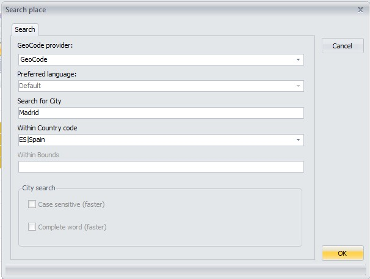  
    <li>You can disable this dialog in Preferences. </li>
    <li>Click on <b>OK</b> to start the search. </li>
    <li>The <b>Places found</b> dialog appears.  </li>
      
    <li>Click on <b>OK</b>, or Double-click to reposition the map to the selected place.</li>
    <li><b>Retry</b> will return to the Search place dialog.</li>
</ul>
 
 

<b>Home</b> button 
Moves the map cursor to your predefined position. 
Clears any tracks shown on the map. 
 

<b>Set^</b> button 
Current map cursor position becomes Home position. 
 

<b>Geotag files</b> button 
By clicking on this button, all selected files will be geotagged with current map cursor position. 
<u>Notes:</u>

<ul>
    <li>The coordinates displayed in the <b>Find:</b> edit box are used. They could be different from the center of the map! 
    Examples that have happened to me:</li>
    <ul>
        <li>You type the name of a City, but dont press Enter to search.</li>
        <li>You paste coordinates in the edit box.</li>
    </ul>
    <li>The Geotag files dialog appears. </li>
    <li>You can disable this dialog in Preferences.  
      </li>
    <li>You can also manually update these fields.</li>
    <li>Location is an exception, it will never be automatically filled. You can only update it manually. </li>
    <li>Choose which fields to update:</li>
    <li>Coordinates (Lat, Lon)</li>
    <li>Location (Country, Province, City)</li>
    <li>Coordinates and Location</li>
    <li>Click on <b>OK</b>, to GeoTag the files.</li>
      
    <li><a name="m_geotag_setup">Setting up Geo tagging</a> </li>
    <li>Use the <b>Setup Geo</b> button to customize how City, Province and Country are filled.  
    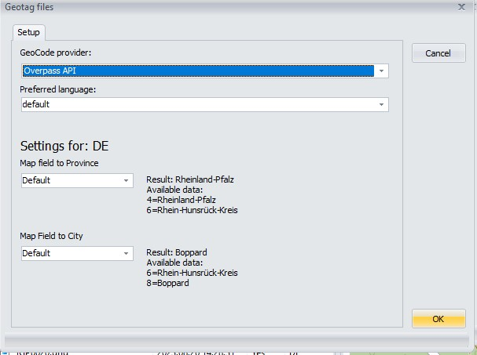</li>
</ul>
  
<a href="Readme GeoCoding.txt">Readme GeoCoding.txt</a>
 
 
<h1><a name="final">Final words</a></h1>
 All credits go to Phil and Bogdan. A quote from Bogdan that still applies: 
<em>
Well.. that's it. 
P.S.: Don't blame me for my English grammar -it's not my native language. 
</em>

 Frank 
Modified on January, 2026 
 

<u>You may find additional info in the ReadMe files:</u>
<ul>
    <li><a href="ReadMe for Developers.txt">ReadMe for Developers</a></li>
    <li><a href="..\Source\Vcl.ShellControls\ReadMe.txt">ReadMe ShellControls</a></li>
    <li><a href="..\Source\NativeJpg\README.txt">ReadMe NativeJpg</a></li>
    <li><a href="..\Source\BreadcrumbBar\README.txt">ReadMe Breadcrumb Bar</a></li>
    <li><a href="..\Source\Xml.VerySimple\readme.txt">ReadMe XML verySimple</a></li>
    <li><a href="Readme keyboard shortcuts.txt">Readme keyboard shortcuts</a></li>
    <li><a href="ReadMe for Users.txt">ReadMe for Users</a></li>
    <li><a href="Readme GeoCoding.txt">Readme GeoCoding</a></li>
    <li><a href="Readme GeoCoding Getting started.txt">Readme GeoCoding Getting started</a></li>
    <li><a href="Readme Long filenames.txt">Readme Long filenames</a></li>
    <li><a href="Readme Lossless rotate_Import_Export previews.txt">Readme Lossless rotate_Import_Export previews</a></li>
    <li><a href="Readme Portable.txt">Readme Portable</a></li>
    <li><a href="Readme Using Codecs.txt">Readme Using Codecs</a></li>
    <li><a href="Readme Using a custom Map tiler server.md">Readme Using a custom Map tiler server</a></li>
</ul>
</body>
</html>
