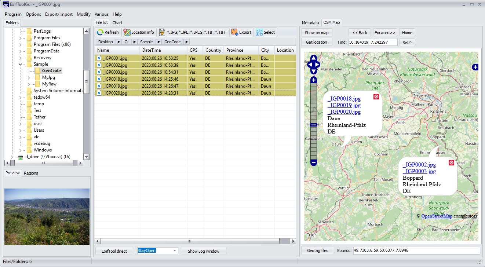
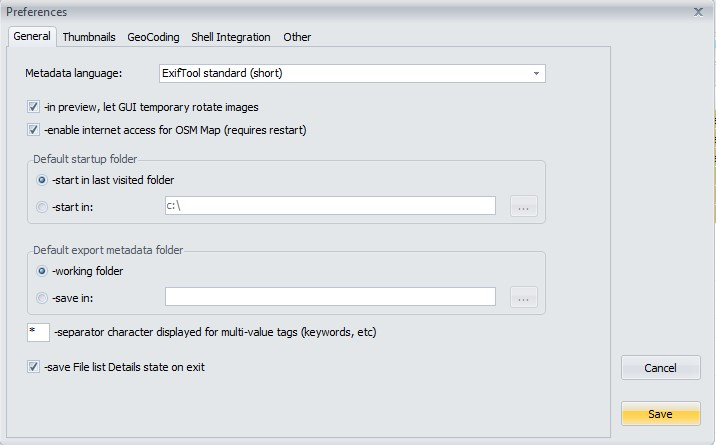

# ExifToolGui Showcase
<h4>Main view</h4>

A screenshot of the ExifTool GUI. It prominently displays a directory tree browser, preview of the image, filelist, and finally all metadata. 

The same folder, but showing thumbnails, and the log window showing the commands issued. 

Geocoding. Tagging you files, and showing them on an OpenStreetMap map. 

<h4>Preferences</h4>

<h4>Options</h4>

<h4>Export Import</h4>

<h4>Modify</h4>

<h4>Various</h4>

<h4>Online Documentation</h4>

