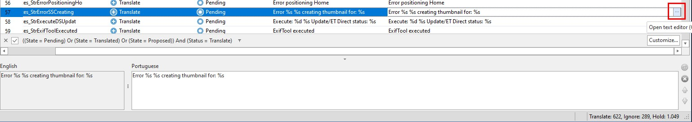

# ExifToolGui. Create or update a translation 
<h4>Preparation</h4>

<li>Download and install the Better Translation Manager.</li>

https://bitbucket.org/anders_melander/better-translation-manager/downloads/amTranslationManagerInstall-2.0.8628.33873.exe

<li>Create a new directory for translation.</li>

It should contain:
- The 32 Bits executable. (Has to do with naming, works best when it's the same name as the .Drc file)  
- ExifToolGui.Drc
- ExifToolGui_xx.xlat Where xx is the language code you want to translate. If your language is not listed, take any language and rename the file to the language code of your choice.

<li>Open the .xlat file in the Better Translation Manager, and start translating</li>
- Regularly save.  
- When you want to test. Click on Build. That should create a translation DLL. ExifToolGui.xxx  
  If the language matches your Windows language, it will automatically be selected when you start ExifToolGui.  
  You can also use a command line parameter /LANG=xxx to override the default.

<h4>Things to keep in mind when translating</h4>

<li>Verify the source and target language</li>
- If not correct, you can change them.

<li>At the time of writing 2 languages are working</li>
- EN (English) The languge that ExifToolGui was originally developed in. This is the default, it does not need a separate module. 
- NL (Dutch) I did this translation myself to make sure it works. 

When translating you have 1 source and 1 target language. The modules supplied all have source language EN. But anyone that would prefer to have NL as source language contact me.

<li>Not all text's need translating</li>
- I have marked a lot of text's as 'Dont Translate'. These text's normally dont show up. But even then there are about 622 text's to translate.

<li>Keep track of what's remaining</li>
- When the state moves from 'pending' to 'proposed' consider it done. You can use 'accepted' if you want to review all your 'proposed' text's and mark them as OK. 
- If the text is equal in the source and target language, use right-click and set it to 'accepted'.

<li>Searching</li>
- The searching is really powerful. 

<li>Text editor</li>
- Special characters. 
  When you see %s, %d etc. then at runtime a value is substituted. Keep these, or the program will give an error.  
  When you see an & it can define a shortcut in a menu. Likely they will need changing after translation.  
  Example: &Save will underline the letter S, and make that the keyboard shortcut.
  
- You can type the translation directly in the grid. But I find it clearer to keep the texteditor window open. You can access it via a small button on the right of the line. 

 

<h4>If you want to help translating, contact me by creating an issue on GitHub.</h4>

Frank
